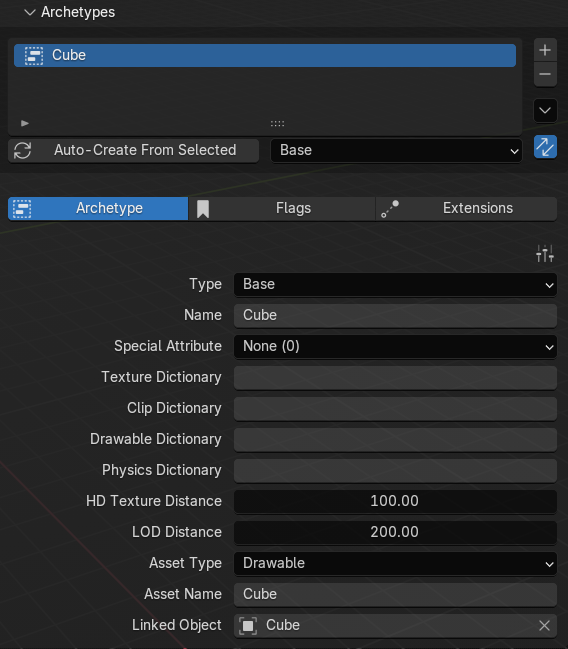

# 📇 Archetype Definition (.ytyp)

**Archetype definitions (.ytyp) is basically the configuration file to define properties of objects.**\
\
inside the .ytyp you will find multiple Archetypes, each archetype is for one object, there is 3 types of archetypes, Base, Time and MLO. Base is for .ydr, .ydd, .yft objects, Time archetypes are for time based objects such as window emissives that only show up at night. MLO archetypes are for MLOs (.ybn) objects. 

*    

    <figure><figcaption></figcaption></figure>

<table><thead><tr><th width="266.3333333333333">Settings</th><th width="628">Description</th><th data-hidden></th></tr></thead><tbody><tr><td><code>Type</code></td><td>Archetype type (Base, Time, MLO)</td><td></td></tr><tr><td><code>Name</code></td><td>Archetype Name</td><td></td></tr><tr><td><code>Special Attribute</code></td><td>Marks the archetype as a special kind of object, most often a door, but also lights, bushes and a few others</td><td></td></tr><tr><td><code>Texture Dictionary</code></td><td>Texture dictionary (.YTD)</td><td></td></tr><tr><td><code>Clip Dictionary</code></td><td>Linked YCD Animation (.YCD)</td><td></td></tr><tr><td><code>Drawable Dictionary</code></td><td>The .YDD this archetype's model comes from. Blank when the model is not inside a dictionary</td><td></td></tr><tr><td><code>Physics Dictionary</code></td><td>Blank or same as Archetype Name if embedded</td><td></td></tr><tr><td><code>HD Texture Distance</code></td><td>Distance at which the HD Textures (+hi.ytd, +hidr.ytd) load</td><td></td></tr><tr><td><code>LOD Distance</code></td><td>Distance at which the object unloads</td><td></td></tr><tr><td><code>Asset Type</code></td><td>Assetless, Drawable Dictionary (.YDD), Drawable (.YDR), Fragment (.YFT), Uninitialized</td><td></td></tr><tr><td><code>Asset Name</code></td><td>Same as Archetype Name</td><td></td></tr><tr><td><code>Linked Object</code></td><td>Object in blender scene linked to the archetype</td><td></td></tr></tbody></table>

