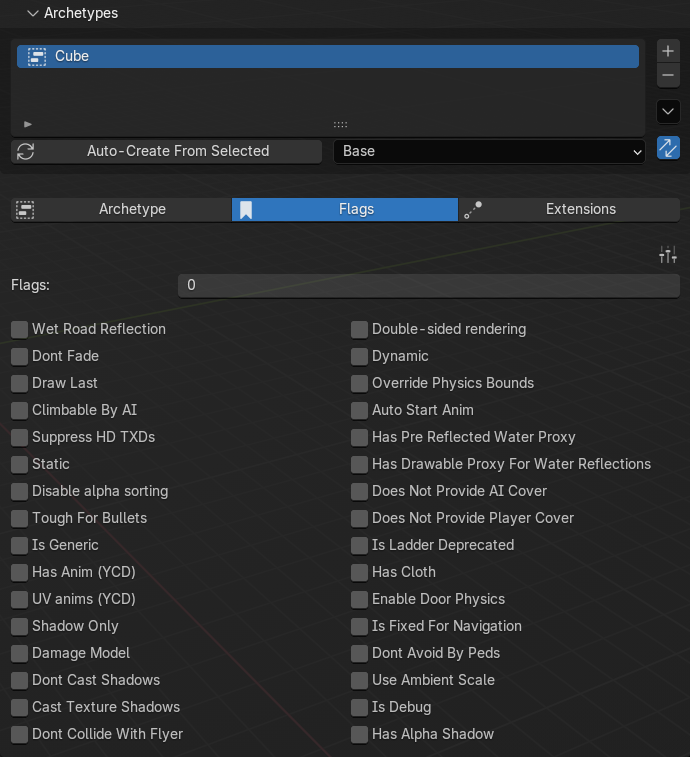

# Archetype Flags

<figure><figcaption></figcaption></figure>

<table><thead><tr><th width="316">Flag</th><th>Description</th></tr></thead><tbody><tr><td><code>Wet Road Reflection</code></td><td>Contributes to reflections on wet road surfaces</td></tr><tr><td><code>Dont Fade</code></td><td>The entity does not fade with distance, it pops in and out instead</td></tr><tr><td><code>Draw Last</code></td><td>Drawn after everything else, so transparent surfaces such as glass blend correctly over what is behind them</td></tr><tr><td><code>Climbable By AI</code></td><td>Peds may climb over it</td></tr><tr><td><code>Suppress HD TXDs</code></td><td>High detail texture dictionaries are never streamed in, useful for props never seen close up</td></tr><tr><td><code>Static</code></td><td>Freezes the entity and disables physics, the default for most map props</td></tr><tr><td><code>Disable alpha sorting</code></td><td>Changes how the entity is written to the depth buffer, can help or hurt when transparent surfaces overlap; try it alongside <code>Draw Last</code></td></tr><tr><td><code>Tough For Bullets</code></td><td>Bullets neither penetrate nor scar the surface</td></tr><tr><td><code>Is Generic</code></td><td>Appears to mark archetypes reused across many locations, poorly understood (used for procedural objects)</td></tr><tr><td><code>Has Anim (YCD)</code></td><td>The archetype has an associated clip dictionary</td></tr><tr><td><code>UV anims (YCD)</code></td><td>The archetype has UV animations, used for scrolling signs and conveyor belts</td></tr><tr><td><code>Shadow Only</code></td><td>The entity is invisible but still casts a shadow, commonly used to fake shadows cheaply</td></tr><tr><td><code>Damage Model</code></td><td>The archetype has a damaged state, as street lights and hydrants do</td></tr><tr><td><code>Dont Cast Shadows</code></td><td>The entity is visible but casts no shadow</td></tr><tr><td><code>Cast Texture Shadows</code></td><td>Related to alpha-aware shadows, but its effect is unclear. <code>Has Alpha Shadow</code> appears to be the flag that actually drives them</td></tr><tr><td><code>Dont Collide With Flyer</code></td><td>Aircraft pass straight through</td></tr><tr><td><code>Double-sided rendering</code></td><td>Back faces are rendered too, commonly used on foliage</td></tr><tr><td><code>Dynamic</code></td><td>The entity is simulated by physics and can be pushed or knocked over</td></tr><tr><td><code>Override Physics Bounds</code></td><td>Uses the collision bounds defined on the archetype instead of those embedded in the model</td></tr><tr><td><code>Auto Start Anim</code></td><td>The animation plays on its own, without a script starting it</td></tr><tr><td><code>Has Pre Reflected Water Proxy</code></td><td>Has a simplified version prepared for water reflections</td></tr><tr><td><code>Has Drawable Proxy For Water Reflections</code></td><td>The water reflection proxy is a separate drawable</td></tr><tr><td><code>Does Not Provide AI Cover</code></td><td>Peds will not take cover behind it</td></tr><tr><td><code>Does Not Provide Player Cover</code></td><td>The player cannot take cover behind it</td></tr><tr><td><code>Is Ladder Deprecated</code></td><td>Legacy ladder flag, no longer used</td></tr><tr><td><code>Has Cloth</code></td><td>The model contains simulated cloth</td></tr><tr><td><code>Enable Door Physics</code></td><td>Enables door physics, the archetype's <a href="./"><mark style="color:$primary;">special attribute</mark></a> must also be set to the kind of door, otherwise the flag does nothing.</td></tr><tr><td><code>Is Fixed For Navigation</code></td><td>The object is already part of the navigation mesh, so peds do not steer around it at runtime</td></tr><tr><td><code>Dont Avoid By Peds</code></td><td>Peds do not steer around it while pathfinding, collision still applies</td></tr><tr><td><code>Use Ambient Scale</code></td><td>Takes the ambient lighting scale from the surrounding area instead of computing its own</td></tr><tr><td><code>Is Debug</code></td><td>Appears to mark development-only content, poorly understood</td></tr><tr><td><code>Has Alpha Shadow</code></td><td>The archetype casts an alpha-aware shadow</td></tr></tbody></table>

