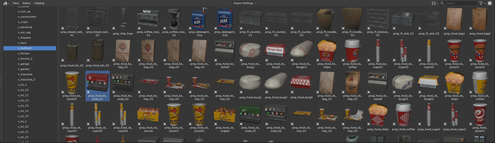

# 📚 Asset Libraries

Asset libraries give you quick access to vanilla props or your own props for placement in maps or MLO interiors, or for instancing entities when importing them.

<figure><figcaption>
An asset library
</figcaption></figure>

<figure><figcaption>
Asset Library panel
</figcaption></figure>

**"Import To Asset Library"** is used to import drawables or fragments directly to the current `.blend` asset library, instead of to the scene.

**"Build Asset Library"** scans a directory of game files and builds `.blend` asset libraries from the YTYPs and assets it finds, including files inside RPFs. If a YTYP contains an MLO, the whole MLO is also saved as an asset, which can later be placed in maps as an [MLO instance](maps/entities/#mlo-instances).

This operator parallelizes the work across multiple Blender background processes, significantly speeding up the build. Libraries are managed from the add-on preferences and integrate with Blender's asset browser.

When instancing entities from YMAPs or YTYP MLOs, archetypes are resolved from these libraries, after first checking the current .blend. Assets built by Sollumz also embed metadata, allowing features like LOD light baking and entity LOD distance resolution to work without loading the original game files.
