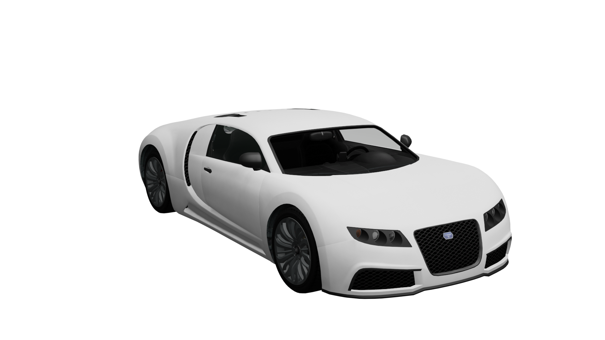

# Vehicle Setup

The example vehicle used in this article is `adder.yft`

<figure><figcaption>
adder.yft
</figcaption></figure>

### Fragment Hierarchy

<figure><figcaption>
adder.yft Blender hierarchy
</figcaption></figure>

### Contents


[Broken link](/broken/pages/9j4qRj41q4nXUJ5mU2WI)



[vehicle-windows.md](vehicle-windows.md)



[light-ids.md](light-ids.md)



[paint-colors.md](paint-colors.md)



[Broken link](/broken/pages/8j7N827Pmlg8lqryVtnf)



[export-settings.md](export-settings.md)

