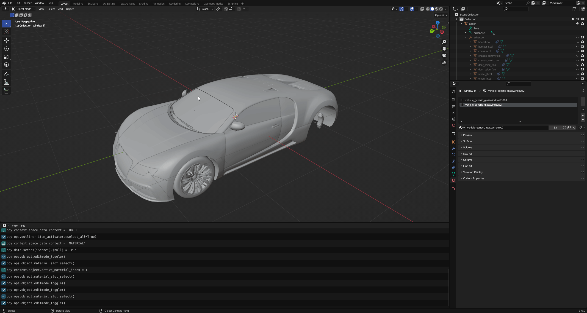

# Vehicle Windows

Breakable vehicle windows are configured on the window's **collision** object.

#### Setting up a window

For a window to be exported as breakable, four things must line up:

* The window mesh uses the `VEHICLE VEHGLASS` shader, and is skinned to a bone that has physics enabled. The inner pane uses `VEHICLE VEHGLASS INNER`. See [Vehicle Shaders](../vehicle-shaders.md) for both shaders.
* That bone has a collision (a Bound Geometry) attached to it.
* The collision uses one of the `Car Glass` collision materials. `Car Glass Bulletproof` makes the window indestructible.
* The collision's shattermap mode is not set to `No`.

Sollumz finds the outer glass geometry by itself, so unlike in older versions there is no `Window Material` property to point at the right material.

For example, in `adder.yft`, looking at the `window_lf` mesh materials, we see that it uses two `vehicle_generic_glasswindows2` materials.

<figure><figcaption>
window_lf | Materials
</figcaption></figure>

This is because one material represents the inner glass and the other represents the outer glass. Go into Edit Mode and select the vertices of each material to see which one represents the outer glass.

<figure><figcaption>
Determining which material is the outer glass material
</figcaption></figure>

#### Shattermap Modes

Select the window collision object and navigate to `Object Properties > Sollumz > Physics > Vehicle Window Shattermap`.

<figure><figcaption>
Object Properties > Sollumz > Physics > Vehicle Window Shattermap
</figcaption></figure>

<table><thead><tr><th width="89">Mode</th><th width="601">Description</th></tr></thead><tbody><tr><td><code>No</code></td><td>Never export this collision as a breakable vehicle window.</td></tr><tr><td><code>Auto</code></td><td>Default. Detect whether this is a vehicle window and, if so, make it breakable with an automatically generated shattermap. Skipped if it isn't detected as a window.</td></tr><tr><td><code>Simple</code></td><td>Breakable window without a shattermap. When broken it leaves no residual glass around the frame. Mainly used for siren glass.</td></tr><tr><td><code>Manual</code></td><td>Breakable window with a shattermap created from an image you provide.</td></tr></tbody></table>

`Auto` is the recommended mode. You only need `Manual` if you want precise control over the glass-breaking pattern, and `Simple` for glass that should shatter completely, such as siren glass.


Automatic shattermap generation needs the optional **PyMateria** dependency. Install it from the Sollumz add-on preferences. Without it, `Auto` windows are skipped on export with the warning "PyMateria is not installed. Cannot automatically generate vehicle window shattermaps."


#### **Exposed Edges**

In `Auto` mode, the **blue channel** of the `Color 1` color attribute on the window mesh guides the generated shattermap. It marks where the glass border connects to the frame: border vertices painted **blue leave a border of broken glass** behind when the window shatters, while the ones left **black are treated as exposed edges** (those without a frame around them) and break cleanly.

<figure><figcaption>
<code>panto.yft | window_lf</code> colors blue channel
</figcaption></figure> <figure><figcaption>
<code>police3.yft | window_lf</code>  colors blue channel
</figcaption></figure>

You can paint this channel in Blender's Vertex Paint mode. The Sollumz vertex painting tools, including isolating a single channel, are in the `Vertex Paint` tab of the 3D view sidebar.

This only affects generated shattermaps. In `Manual` mode the breaking pattern comes from your image instead, and `Simple` windows have no shattermap at all.


If the blue channel is left entirely black, Sollumz warns that the mesh "has color attribute 'Color 1' with no blue channel data" on export and treats the whole window as connected to the frame.


#### Shattermaps

A "shattermap" is an image that defines the border of the glass-breaking pattern. These are **only required in `Manual` mode**.


By default, importing a fragment does **not** create shattermap objects. The windows are set to `Auto` instead so the shattermaps are regenerated on export. To bring the original shattermaps in as objects (which sets the windows to `Manual`), enable `Import Window Shattermaps` in the import settings panel.


In Sollumz, shattermaps are represented as planes with a single texture, parented to the window collision. For example, `adder.yft` has an object called `windscreen_shattermap` parented to `windscreen.col`.

<figure><figcaption>
windscreen_shattermap
</figcaption></figure>

These are always low-res bitmap greyscale textures. Sollumz has no tools for creating them by hand, so if you want to author one yourself your best bet is to copy a shattermap from a vanilla file and work off of that. Otherwise, leave the window in `Auto` mode and let Sollumz generate one.

With `Manual` mode selected, two extra sets of values appear:

* `Data Min` / `Max`: the range the shattermap values are mapped to. These come from the original file and normally don't need to be changed.
* `Cracks Texture Tiling`: how much the cracks texture is tiled over the window. Also available in `Simple` mode.

Shattermaps can be toggled in the viewport with `Sollumz Tools > View > Show/Hide Shattermaps`.

#### Previewing Exported Windows

The `Preview Windows` button in the `Sollumz Tools > Fragment > Vehicle Tools` panel displays the shattermaps that would be exported for the selected vehicle, so you can check your windows are set up correctly without going in-game. Windows using the `Car Glass Bulletproof` material are listed as `BULLETPROOF` instead of showing a shattermap. Press `Esc` to exit the preview.

{% embed url="https://files.gitbook.com/v0/b/gitbook-x-prod.appspot.com/o/spaces%2FcRAM9lBHCqq3QodZ420I%2Fuploads%2FSUrsrARzTBfCZoDSXI3g%2Fpreview_windows.webm?alt=media&token=ce6173fc-5761-41e3-8465-baaa63015383" %}

#### Troubleshooting

If a window set to `Simple` or `Manual` isn't exported, Sollumz logs a warning explaining why:

* _"is not attached to a bone, or the attached bone does not have physics enabled"_: attach the collision to the window bone with a Copy Transforms constraint and enable physics on that bone.
* _"has no geometry using the 'VEHICLE VEHGLASS' shader"_: the window mesh is missing, not skinned to the window bone, or uses a different shader.

Windows in `Auto` mode are skipped silently when they aren't detected as windows.


The `Breakable Glass` flag in `Bone Properties > Fragment Physics` is a different feature. It is the generic breakable glass used by props, not the vehicle window system described here.

