# Vehicle Shaders

### Vehicle Paint shaders

`vehicle_paint1`



Typical vehicle paint shader, used on most vehicles in GTA V.



* [x] Diffuse
* [x] Dirt
* [x] Specular



<table><thead><tr><th width="205">UV Maps</th><th width="494">Texture</th></tr></thead><tbody><tr><td>UVMap 0</td><td>Diffuse / Specular</td></tr><tr><td>UVMap 1 </td><td>Dirt</td></tr></tbody></table>



<figure><figcaption>
Example of vehicle_paint1 in blista.yft
</figcaption></figure>



***

`vehicle_paint1_enveff`



Basic vehicle paint shader with additional feature of applying snow.

Vertex Alpha: visibility of snow samplers (**black** - non applied, **white** - applied)



* [x] Diffuse
* [x] Snow sampler 0
* [x] Snow sampler 1
* [x] Dirt
* [x] Specular



<table><thead><tr><th width="320">UV Maps</th><th width="379">Texture</th></tr></thead><tbody><tr><td>UVMap 0</td><td>Diffuse / Specular</td></tr><tr><td>UVMap 1 </td><td>Dirt</td></tr></tbody></table>



<figure><figcaption>
Example of vehicle_paint1_enveff from asea2.yft
</figcaption></figure>



***

`vehicle_paint2`



A very similar shader to vehicle\_paint1, with dirt mapping moved to first UV map.



* [x] Diffuse
* [x] Dirt
* [x] Specular



<table><thead><tr><th width="321">UV Maps</th><th width="379">Texture</th></tr></thead><tbody><tr><td>UVMap 0</td><td>Diffuse / Specular / Dirt</td></tr></tbody></table>



<figure><figcaption>
Example of vehicle_paint2 from burrito3.yft
</figcaption></figure>



***

`vehicle_paint2_enveff`



A copy of vehicle\_paint2 with additional feature of applying snow.

Vertex Alpha: visibility of snow samplers (**black** - non applied, **white** - applied)



* [x] Diffuse
* [x] Snow sampler 0
* [x] Snow sampler 1
* [x] Dirt
* [x] Specular



<table><thead><tr><th width="321">UV Maps</th><th width="379">Texture</th></tr></thead><tbody><tr><td>UVMap 0</td><td>Diffuse / Specular / Dirt</td></tr></tbody></table>



<figure>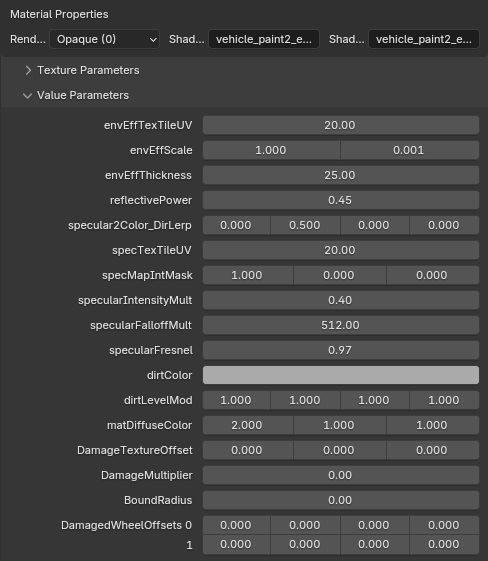<figcaption>
Example of converted material for vehicle_paint2_enveff
</figcaption></figure>



***

`vehicle_paint3`



Used for liveries on a car.



* [x] Diffuse
* [x] Second diffuse
* [x] Dirt
* [x] Specular



<table><thead><tr><th width="319">UV Maps</th><th width="379">Texture</th></tr></thead><tbody><tr><td>UVMap 0</td><td>Diffuse / Dirt</td></tr><tr><td>UVMap 1</td><td>Second diffuse / Specular</td></tr></tbody></table>



<figure><figcaption>
Example of vehicle_paint3 from buffalo3.yft
</figcaption></figure>



***

`vehicle_paint3_enveff`



A copy of vehicle\_paint3 with additional feature of applying snow.

Vertex Alpha: visibility of snow samplers (**black** - non applied, **white** - applied)



* [x] Diffuse
* [x] Snow sampler 0
* [x] Snow sampler 1
* [x] Second diffuse
* [x] Dirt
* [x] Specular



<table><thead><tr><th width="319">UV Maps</th><th width="379">Texture</th></tr></thead><tbody><tr><td>UVMap 0</td><td>Diffuse / Dirt / Enveff tileable UV (edited in envEffTexTileUV)</td></tr><tr><td>UVMap 1</td><td>Second diffuse / Specular</td></tr></tbody></table>



<figure>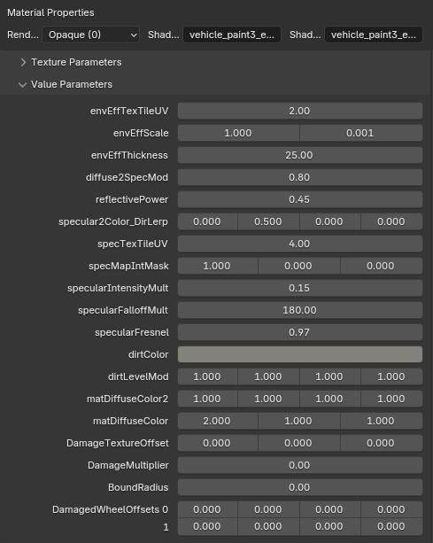<figcaption>
Example of vehicle_paint3_enveff from stunt.yft
</figcaption></figure>



***

`vehicle_paint3_lvr`



Variant of vehicle\_paint3 with tileable livery via second UV Map.



* [x] Diffuse
* [x] Third diffuse
* [x] Dirt
* [x] Specular



<table><thead><tr><th width="319">UV Maps</th><th width="379">Texture</th></tr></thead><tbody><tr><td>UVMap 0</td><td>Diffuse / Dirt</td></tr><tr><td>UVMap 1</td><td>Livery / Specular</td></tr></tbody></table>



<figure>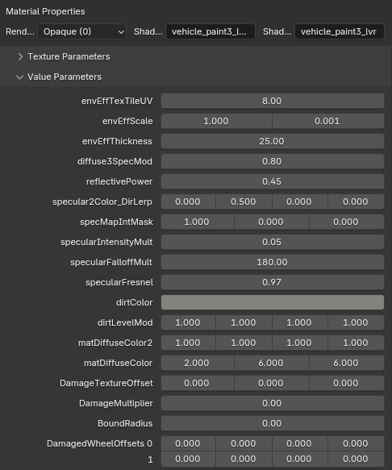<figcaption>
Example of vehicle_paint3_lvr from tornado5.yft
</figcaption></figure>



***

`vehicle_paint4`



Used for metal worn effect and/or livery on a car.



* [x] Diffuse
* [x] Second diffuse
* [x] Dirt
* [x] Specular



<table><thead><tr><th width="321">UV Maps</th><th width="379">Texture</th></tr></thead><tbody><tr><td>UVMap 0</td><td>Dirt / Diffuse tileable UV (edited in DiffuseTexTileUV)</td></tr><tr><td>UVMap 1</td><td>Tileable specular (edited in specTexTileUV)</td></tr></tbody></table>



<figure><figcaption>
Example of vehicle_paint4 from banshee.yft
</figcaption></figure>



***

`vehicle_paint4_emissive`



Very same vehicle\_paint4 shader with support of emissives.



* [x] Diffuse
* [x] Snow sampler 0
* [x] Snow sampler 1
* [x] Second diffuse
* [x] Dirt
* [x] Specular



<table><thead><tr><th width="321">UV Maps</th><th width="379">Texture</th></tr></thead><tbody><tr><td>UVMap 0</td><td>Dirt / Diffuse tileable UV (edited in DiffuseTexTileUV)</td></tr><tr><td>UVMap 1</td><td>Tileable specular (edited in specTexTileUV)</td></tr></tbody></table>



<figure>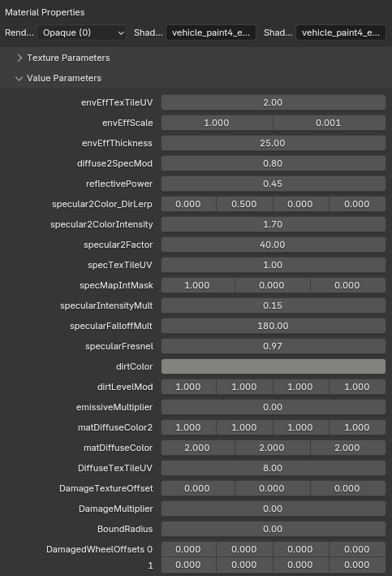<figcaption>
Example of vehicle_paint4_emissive from blimp3.yft
</figcaption></figure>



***

`vehicle_paint4_enveff`



vehicle\_paint4 shader, used for metal worn effect and liveries on a car.

Vertex Alpha: visibility of snow samplers (**black** - non applied, **white** - applied)



* [x] Diffuse
* [x] Snow sampler 0
* [x] Snow sampler 1
* [x] Second diffuse
* [x] Dirt
* [x] Specular



<table><thead><tr><th width="321">UV Maps</th><th width="379">Texture</th></tr></thead><tbody><tr><td>UVMap 0</td><td>Dirt / Diffuse tileable UV (edited in DiffuseTexTileUV)</td></tr><tr><td>UVMap 1</td><td>Tileable specular (edited in specTexTileUV)</td></tr></tbody></table>



<figure>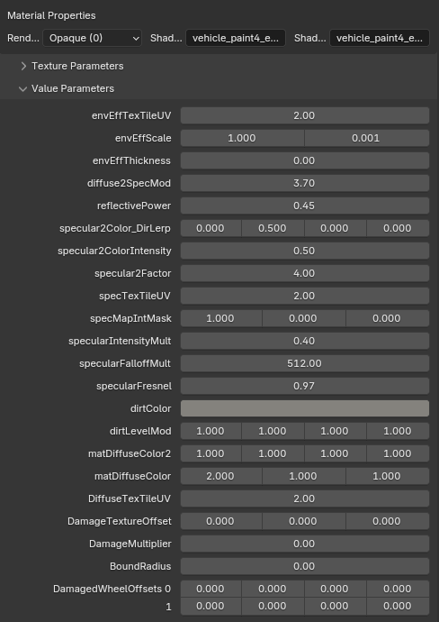<figcaption>
Example of vehicle_paint4_enveff from caddy3.yft
</figcaption></figure>



***

`vehicle_paint5_enveff`



Used for metal worn effect and liveries on a car.

Vertex Alpha: visibility of snow samplers (**black** - non applied, **white** - applied)



* [x] Diffuse
* [x] Snow sampler 0
* [x] Snow sampler 1
* [x] Second diffuse
* [x] Dirt
* [x] Specular



<table><thead><tr><th width="320">UV Maps</th><th width="379">Texture</th></tr></thead><tbody><tr><td>UVMap 0</td><td>Dirt / Diffuse tileable UV (edited in DiffuseTexTileUV)</td></tr><tr><td>UVMap 1 </td><td>Livery</td></tr></tbody></table>



<figure><figcaption>
Example of vehicle_paint5_enveff from camper.yft
</figcaption></figure>



***

`vehicle_paint6`



Used for metal bolts on planes, applying liveries, metal worn effect.



* [x] Diffuse
* [x] Second diffuse
* [x] Dirt
* [x] Normal map
* [x] Specular



<table><thead><tr><th width="320">UV Maps</th><th width="379">Texture</th></tr></thead><tbody><tr><td>UVMap 0</td><td>Dirt / Diffuse tileable UV (edited in DiffuseTexTileUV)</td></tr><tr><td>UVMap 1 </td><td>Livery</td></tr></tbody></table>



<figure><figcaption>
Example of vehicle_paint6 from utillitruck.yft
</figcaption></figure>



`vehicle_paint7`



Used for metal worn effect and liveries on a car.



* [x] Diffuse
* [x] Second diffuse
* [x] Dirt
* [x] Specular



<table><thead><tr><th width="320">UV Maps</th><th width="379">Texture</th></tr></thead><tbody><tr><td>UVMap 0</td><td>Dirt / Specular / Diffuse tileable UV (edited in DiffuseTexTileUV)</td></tr><tr><td>UVMap 1 </td><td>Livery</td></tr></tbody></table>



<figure>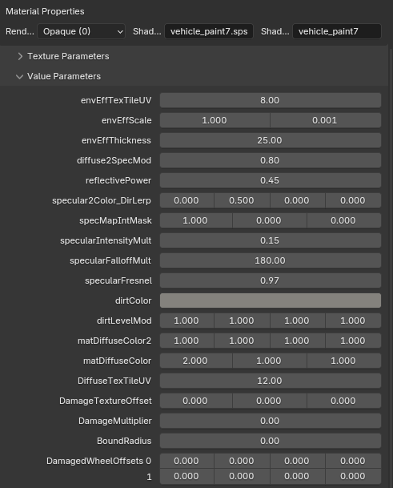<figcaption>
Example of vehicle_paint7 from phantom2.yft
</figcaption></figure>



***

`vehicle_paint7_enveff`



Used for metal worn effect and liveries on a car.

Vertex Alpha: visibility of snow samplers (**black** - non applied, **white** - applied)



* [x] Diffuse
* [x] Snow sampler 0
* [x] Snow sampler 1
* [x] Second diffuse
* [x] Dirt
* [x] Specular



<table><thead><tr><th width="320">UV Maps</th><th width="379">Texture</th></tr></thead><tbody><tr><td>UVMap 0</td><td>Dirt / Diffuse tileable UV (edited in DiffuseTexTileUV)</td></tr><tr><td>UVMap 1 </td><td>Livery</td></tr></tbody></table>



<figure><figcaption>
Example of vehicle_paint7_enveff from wastelander.yft
</figcaption></figure>



***

`vehicle_paint8`



Used for metal worn effect and liveries on a car.

Vertex Alpha: visibility of snow samplers (**black** - non applied, **white** - applied)



* [x] Diffuse
* [x] Snow sampler 0
* [x] Snow sampler 1
* [x] Second diffuse
* [x] Dirt
* [x] Dirt normal map
* [x] Normal map
* [x] Specular



<table><thead><tr><th width="320">UV Maps</th><th width="379">Texture</th></tr></thead><tbody><tr><td>UVMap 0</td><td>Dirt normal map</td></tr><tr><td>UVMap 1 </td><td>Diffuse tileable UV (edited in DiffuseTexTileUV) / Snow sampler tileable UV (edited in envEffTexTileUV)/ Livery / Specular</td></tr><tr><td>UVMap 2</td><td>Dirt</td></tr></tbody></table>



<figure>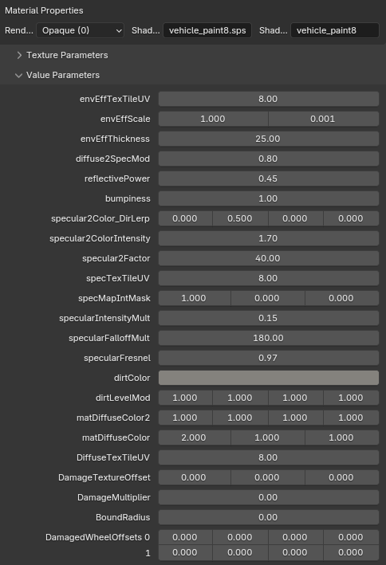<figcaption>
Example of vehicle_paint8 from brutus.yft
</figcaption></figure>



***

`vehicle_paint9`



Used for metal worn effect and liveries on a car.

Vertex Alpha: visibility of snow samplers (**black** - non applied, **white** - applied)



* [x] Diffuse
* [x] Snow sampler 0
* [x] Snow sampler 1
* [x] Second diffuse
* [x] Dirt
* [x] Dirt normal map
* [x] Normal map
* [x] Specular



<table><thead><tr><th width="320">UV Maps</th><th width="379">Texture</th></tr></thead><tbody><tr><td>UVMap 0</td><td>Dirt normal map</td></tr><tr><td>UVMap 1 </td><td>Livery</td></tr><tr><td>UVMap 2</td><td>Dirt / Diffuse tileable UV (edited in DiffuseTexTileUV) / Snow sampler tileable UV (edited in envEffTexTileUV) / Specular</td></tr></tbody></table>



<figure>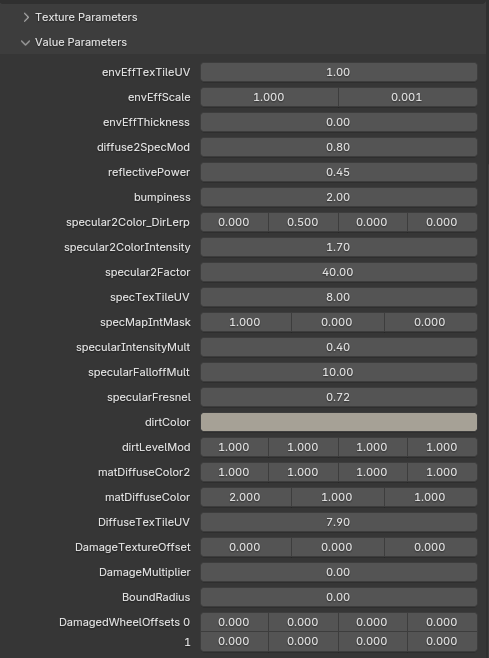<figcaption>
Example of vehicle_paint9 from conada.yft
</figcaption></figure>



***

### Vehicle Light shaders

`vehicle_lightsmeissive`



Allows the light to be lit.



* [x] Diffuse
* [x] Dirt
* [x] Specular



<table><thead><tr><th width="319">UV Maps</th><th width="379">Texture</th></tr></thead><tbody><tr><td>UVMap 0</td><td>Diffuse / Specular</td></tr><tr><td>UVMap 1 </td><td>Dirt</td></tr></tbody></table>



<figure><figcaption>
Example of vehicle_lightsemissive from asea2.yft
</figcaption></figure>



Lights ID values for different type of vehicle lights, available in Fragments / Vehicle Light IDs

<figure><figcaption>
Lights ID
</figcaption></figure>

***

### Vehicle Glass shaders

`vehicle_vehglass`



Shader specifically tailored to work with windows and other glasses.



* [x] Diffuse
* [x] Dirt
* [x] Specular



<table><thead><tr><th width="320">UV Maps</th><th width="379">Texture</th></tr></thead><tbody><tr><td>UVMap 0</td><td>Diffuse /  Specular</td></tr><tr><td>UVMap 1</td><td>Dirt</td></tr></tbody></table>



<figure>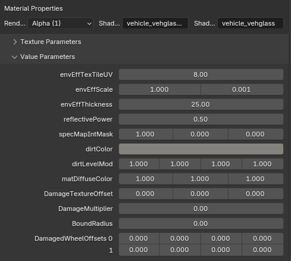<figcaption>
Example of vehicle_vehglass from buffalo2.yft
</figcaption></figure>



***

`vehicle_vehglass_inner`



Identical shader to vehicle\_vehglass, used for inner side of windows/glasses, with limited dirt intensity.



* [x] Diffuse
* [x] Dirt
* [x] Specular



<table><thead><tr><th width="320">UV Maps</th><th width="379">Texture</th></tr></thead><tbody><tr><td>UVMap 0</td><td>Diffuse /  Specular</td></tr><tr><td>UVMap 1</td><td>Dirt</td></tr></tbody></table>



<figure>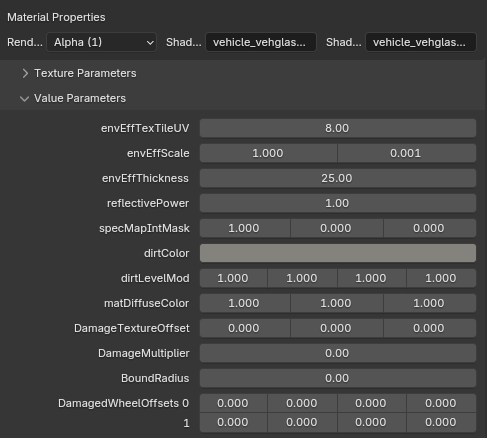<figcaption>
Example of vehicle_vehglass_inner from buffalo2.yft
</figcaption></figure>



***

### Vehicle Interior shaders

`vehicle_interior`



Simple interior shader with normal map support.



* [x] Diffuse
* [x] Normal map
* [x] Specular



<table><thead><tr><th width="321">UV Maps</th><th width="379">Texture</th></tr></thead><tbody><tr><td>UVMap 0</td><td>Diffuse / Normal map / Specular</td></tr></tbody></table>



<figure><figcaption>
Example of vehicle_interior from vigero.yft
</figcaption></figure>



***

`vehicle_interior2`

Simple interior shader without normal map support.



Simple interior shader without normal map support.



* [x] Diffuse
* [x] Specular



<table><thead><tr><th width="320">UV Maps</th><th width="379">Texture</th></tr></thead><tbody><tr><td>UVMap 0</td><td>Diffuse /  Specular</td></tr></tbody></table>



<figure><figcaption>
Example of vehicle_interior2 from burrito3.yft
</figcaption></figure>



***

### Vehicle Mesh shaders

`vehicle_mesh`



Extensively used for metallic vehicle parts, like exhausts, engines, chassis parts.



* [x] Diffuse
* [x] Dirt
* [x] Normal map
* [x] Specular



<table><thead><tr><th width="321">UV Maps</th><th width="379">Texture</th></tr></thead><tbody><tr><td>UVMap 0</td><td>Diffuse /  Normal map / Specular</td></tr><tr><td>UVMap 1</td><td>Dirt</td></tr></tbody></table>



<figure><figcaption>
Example of vehicle_mesh from vigero.yft
</figcaption></figure>



***

`vehicle_mesh_enveff`



Extensively used for metallic vehicle parts, like exhausts, engines, chassis parts with additional feature of applying snow.

Vertex Alpha: visibility of snow samplers (**black** - non applied, **white** - applied)















***

### Vehicle Tire shaders

`vehicle_tire`



A shader for wheels, **cannot be used** on any other vehicle parts.



* [x] Diffuse
* [x] Dirt
* [x] Normal map
* [x] Specular



<table><thead><tr><th width="321">UV Maps</th><th width="379">Texture</th></tr></thead><tbody><tr><td>UVMap 0</td><td>Diffuse /  Dirt / Normal map / Specular</td></tr></tbody></table>



<figure><figcaption>
Example of vehicle_tire from vigero.yft
</figcaption></figure>



***

`vehicle_tire_emissive`



vehicle\_tire shader with emissive support



* [x] Diffuse
* [x] Dirt
* [x] Normal map
* [x] Specular



<table><thead><tr><th width="321">UV Maps</th><th width="379">Texture</th></tr></thead><tbody><tr><td>UVMap 0</td><td>Diffuse /  Dirt / Normal map / Specular</td></tr></tbody></table>



<figure>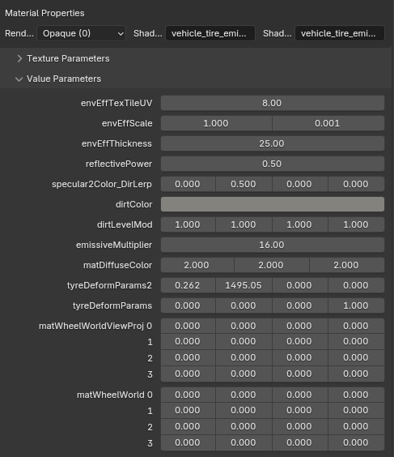<figcaption>
Example of vehicle_tire_emissive from tezeractyft
</figcaption></figure>



***

### Vehicle Emissive shaders

`vehicle_dash_emissive`



Shader dedicated for emissive dials being lit up at night.



* [x] Diffuse
* [x] Specular



<table><thead><tr><th width="320">UV Maps</th><th width="379">Texture</th></tr></thead><tbody><tr><td>UVMap 0</td><td>Diffuse  / Specular</td></tr></tbody></table>



<figure><figcaption>
Example of vehicle_dash_emissive from vigero.yft
</figcaption></figure>



***

`vehicle_dash_emissive_opaque`



Shader dedicated for emissive dials being lit up at night for opaque textures.



* [x] Diffuse
* [x] Specular



<table><thead><tr><th width="320">UV Maps</th><th width="379">Texture</th></tr></thead><tbody><tr><td>UVMap 0</td><td>Diffuse  / Specular</td></tr></tbody></table>



<figure><figcaption>
Example of converted material for vehicle_dash_emissive_opaque
</figcaption></figure>



***

### Vehicle License plate shaders

`vehicle_licenseplate`



Shader responsible for rendering vehicle license plates with changeable text.



* [x] Plate background
* [x] Plate background normal map
* [x] Font texture
* [x] Font texture normal map
* [x] Dirt



<table><thead><tr><th width="316">UV Maps</th><th width="379">Texture</th></tr></thead><tbody><tr><td>UVMap 0</td><td>Plate background, Place background bump, Font, Font bump</td></tr><tr><td>UVMap 1</td><td>Dirt</td></tr></tbody></table>



<figure><figcaption>
Example of vehicle_licenseplate from asea2.yft
</figcaption></figure>



***

### Vehicle Miscellaneous shaders

`vehicle_badges`



Shader for vehicle badges.



* [x] Diffuse
* [x] Normal map
* [x] Specular



<table><thead><tr><th width="321">UV Maps</th><th width="379">Texture</th></tr></thead><tbody><tr><td>UVMap 0</td><td>Diffuse  / Normal map / Specular</td></tr></tbody></table>



<figure><figcaption>
Example of vehicle_badges from asea2.yft
</figcaption></figure>



***

`vehicle_decal`



Shader created for adding additional decals, scratches on the vehicle.



* [x] Diffuse
* [x] Specular



<table><thead><tr><th width="320">UV Maps</th><th width="379">Texture</th></tr></thead><tbody><tr><td>UVMap 0</td><td>Diffuse  / Specular</td></tr></tbody></table>



<figure><figcaption>
Example of vehicle_decal from ambulance.yft
</figcaption></figure>



***

`vehicle_decal2`



Derivated from vehicle\_decal, with dirt support.



* [x] Diffuse
* [x] Dirt
* [x] Specular



<table><thead><tr><th width="317">UV Maps</th><th width="379">Texture</th></tr></thead><tbody><tr><td>UVMap 0</td><td>Diffuse  / Dirt / Specular</td></tr></tbody></table>



<figure><figcaption>
Example of vehicle_decal2 from burrito3.yft
</figcaption></figure>



***

`vehicle_detail2`



Used to add a leather detail effect to seats and dashboards.



* [x] Diffuse
* [x] Normal map
* [x] Specular



<table><thead><tr><th width="369">UV Maps</th><th width="379">Texture</th></tr></thead><tbody><tr><td>UVMap 0</td><td>Diffuse  / Normal map / Specular</td></tr><tr><td>UVMap 1</td><td>Detail (tileable)</td></tr></tbody></table>



<figure><figcaption>
Example of vehicle_detail2 from burrito3.yft
</figcaption></figure>



***

`vehicle_shuts`



Shader utilized for inner sides of engine bay, doors, bonnet and boot.



* [x] Diffuse
* [x] Normal map
* [x] Specular



<table><thead><tr><th width="320">UV Maps</th><th width="379">Texture</th></tr></thead><tbody><tr><td>UVMap 0</td><td>Diffuse  / Normal map / Specular</td></tr></tbody></table>



<figure>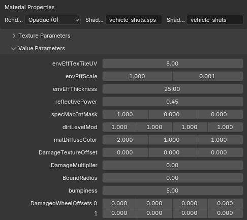<figcaption>
Example of vehicle_shuts from sentinel2.yft
</figcaption></figure>



***

`vehicle_track/vehicle_track2`



Shader for UV animation, **hardcoded usage**, in modded vehicles works only on the left side.



* [x] Diffuse
* [x] Normal map
* [x] Specular



<table><thead><tr><th width="320">UV Maps</th><th width="379">Texture</th></tr></thead><tbody><tr><td>UVMap 0</td><td>Diffuse  / Normal map / Specular</td></tr><tr><td>UVMap 1</td><td>Dirt</td></tr></tbody></table>



<figure>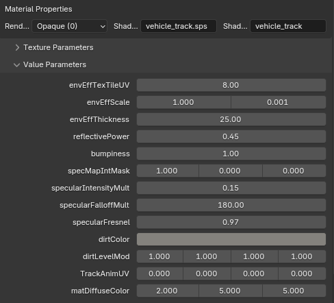<figcaption>
Example of vehicle_track from manchez2.yft
</figcaption></figure>


