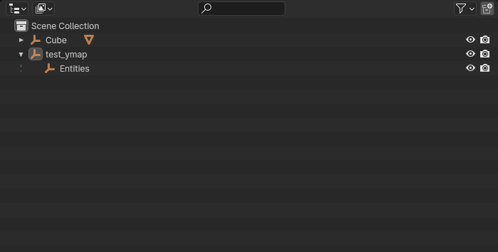

# 🗺️ Map Data (.ymap)

### Prerequisite Knowledge

* Basic Blender skills
* Basic CodeWalker skills

### What you will need

* A Drawable positioned at the world location you want it to be at

### Creating A new YMAP in blender

Open The 'N' Toolbar and navigate to Sollumz Tools -> Map Data

Then Click 'Create YMAP'

<figure><figcaption></figcaption></figure>

we can go ahead and rename our new ymap object, but ensure you rename it here as well.

<figure><figcaption></figcaption></figure>

Now, depending on what you will be using in this YMAP, we can return to the Map Data tab, and create the necessary groups.&#x20;

with the ymap selected, click 'Entities'.

Next, parent your drawable positioned at the world position to the new 'Entities' object. (Shift + Drag)

<figure><figcaption></figcaption></figure>

Next, we can now export our YMAP. Select the YMAP object, and by either pressing V to open the Sollumz Pie Menu, or navigating to Sollumz Tools -> General -> 'Export CodeWalker XML', Export your YMAP Object.&#x20;

### Export Options

There is a handful of export options related to ymap in the export window, keep these in mind in case you are running into any issues.

<figure><figcaption></figcaption></figure>

Lastly, convert the .XML file back to the binary .YMAP by dragging the .XML into any RPF archive in CodeWalker RPF Explorer. It's Recommended you create a new RPF archive in your GTA 5 Root Directory.&#x20;

<figure><figcaption></figcaption></figure>
