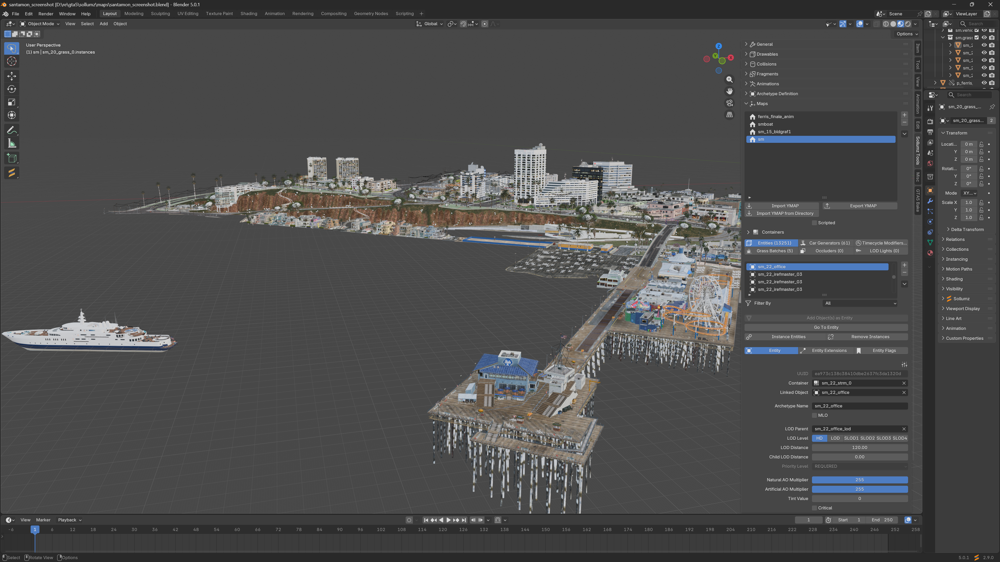

# 🗺️ Maps (.ymap)

<figure><figcaption></figcaption></figure>

### Basic Concepts

Maps are managed through the `Sollumz Tools > Maps` panel in the sidebar.

<figure><figcaption></figcaption></figure>

The first list contains **map groups**. A map group holds a set of **containers** and the\
**map items** assigned to them.

Maps marked as "Scripted" will not be loaded automatically by the game. A script will be needed to load and unload them.

#### Containers

Containers are organized in a hierarchy: each container can have a parent container,\
which corresponds to the YMAP LOD hierarchy in the game. On export, each container\
becomes one YMAP file, named after the container.

<figure><figcaption>
Containers list
</figcaption></figure>

The hierarchy can be partially generated using Auto partioning. See [Partitioning](partitioning.md).

#### Map Items

There are six types of map items: [entities](entities/), [car generators](car-generators.md), [timecycle modifiers](timecycle-modifiers.md), [grass batches](grass-batches.md), [occluders](occluders.md), and [LOD lights](lod-lights.md). Each map item is assigned to a container, which determines the YMAP file it is exported to. Items not assigned to any container are skipped on export with a warning.
