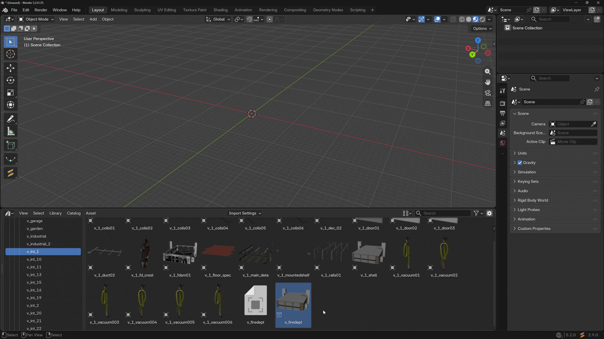

# Entities

Entities represent props, buildings, terrain, or any other models placed in a map. Each entity is linked to a Blender object in the scene. The object defines the archetype name and world transform of the entity.&#x20;

All entity properties and functionality can be found in the Entities tab panel in the sidebar.

<figure><figcaption>
Entities tab panel
</figcaption></figure>

#### Operators

<table><thead><tr><th width="313.333251953125"></th><th>Description</th></tr></thead><tbody><tr><td><strong>Add Object(s) as Entity</strong></td><td>Add the selected objects in the scene to the map as an entity for each object.</td></tr><tr><td><strong>Go To Entity</strong></td><td>Select the object linked to the entity and move the view to its location.</td></tr><tr><td><strong>Instance Entities</strong> / <strong>Remove Instances</strong></td><td>Re-create the entities linked objects after import or delete them. The entities still exist in the map, only the Blender objects are removed from the scene.</td></tr><tr><td><strong>Show / Hide Entities</strong></td><td>Toggle the visibility of entity objects at specific LOD levels.</td></tr></tbody></table>

#### **Properties**

<table><thead><tr><th width="192.6666259765625">Property</th><th>Description</th></tr></thead><tbody><tr><td><strong>LOD Parent</strong></td><td>The parent entity of this entity in the <a href="lod-hierarchy.md">LOD hierarchy</a>.</td></tr><tr><td><strong>LOD Level</strong></td><td>Level of this entity in the LOD hierarchy.</td></tr><tr><td><strong>LOD Distance</strong></td><td>Override the distance at which the object unloads. The default -1 uses the LOD distance defined in the archetype.</td></tr><tr><td><strong>Child LOD Distance</strong></td><td>Override the LOD distance of the children entities of this entity in the LOD hierarchy.</td></tr><tr><td><strong>Priority Level</strong></td><td>Only relevant for <strong>HD</strong> entities. Determines whether the game is allowed to skip creating this entity when loading the map in certain cases. </td></tr><tr><td><strong>Natural AO Multiplier</strong></td><td>Natural ambient occlusion multiplier.</td></tr><tr><td><strong>Artifical AO Multiplier</strong></td><td>Artificial ambient occlusion multiplier.</td></tr><tr><td><strong>Tint Value</strong></td><td>Palette index for models using tint shaders.</td></tr></tbody></table>

#### Entity Extensions

<table><thead><tr><th width="197.3333740234375">Extension</th><th>Description</th></tr></thead><tbody><tr><td><strong>Door</strong></td><td>Additional settings for door entities.</td></tr><tr><td><strong>Spawn Point Override</strong></td><td>Used to override settings from spawn points in the archetype.</td></tr><tr><td><strong>Light Effect</strong></td><td>Used to override settings from lights found in the base model.</td></tr></tbody></table>

***

To quickly view the entity properties associated with the selected object, you can use the "Sollumz > Map Entity Properties" panel in the object properties tab.

<figure><figcaption>
Entity properties of the selected object
</figcaption></figure>

The "View in Sidebar" button synchronizes the selection in the Entities list with the selected objects in the scene.&#x20;

### MLO Instances

MLO instances are used to place interiors in maps. There are two main ways to create MLO instances:

* From an MLO created in the same `.blend` file.
* From an asset library.

The MLO panel in the sidebar has a "Create MLO Instance" button that creates a copy of your MLO as a single object, ready to be placed in a map. The refresh button next to it is used to update all existing instances to reflect the latest changes in the MLO, generally added or deleted entities.

<figure><figcaption>
Location of "Create MLO Instance" button
</figcaption></figure>

When using an [asset library](../../asset-libraries.md) created from a YTYP with MLO, you can simply drag and drop the MLO asset into the scene.

<figure><figcaption>
MLO instance from asset library
</figcaption></figure>

Now, you can add the MLO instance objects to a map like any other entity object, for example using "Add Object(s) as Entity". The new entity should be marked as MLO and the MLO-specific properties appear in the panel.

<figure><figcaption>
MLO instance properties
</figcaption></figure>
