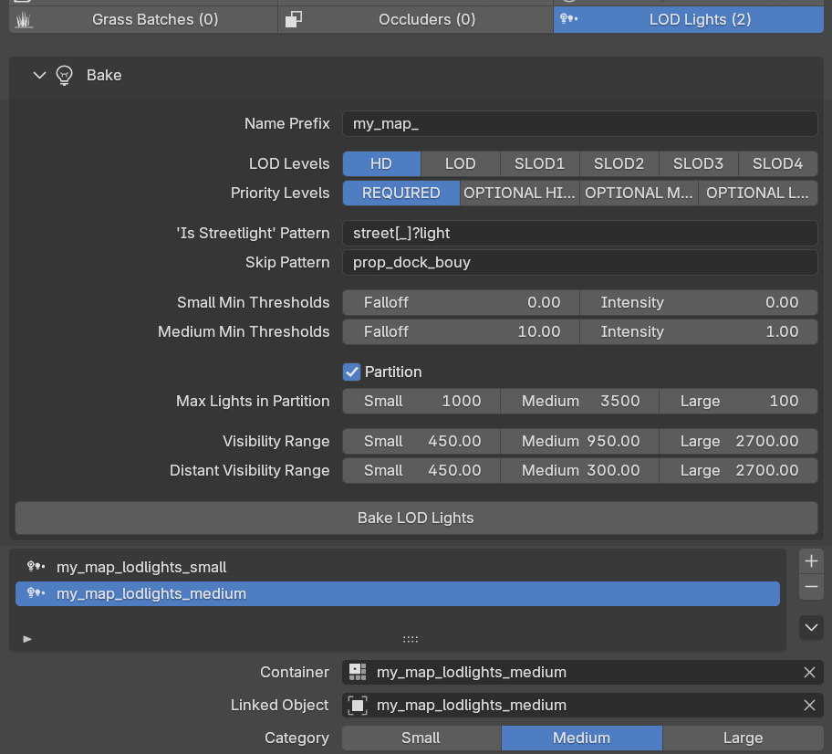

# LOD Lights

LOD lights are represented as a mesh with only vertices, where each vertex represents a light. Attributes are used to store per-light settings.

"Bake LOD Lights" operator collects the lights of all entities in the map group and generates the `lodlights`/`distlodlights` YMAPs automatically, categorized by size, partitioned, and with streaming extents already computed.

<figure><figcaption></figcaption></figure>

| Tier                                     | YMAP       | What it draws                                                     |
| ---------------------------------------- | ---------- | ----------------------------------------------------------------- |
| **LOD lights** (`lodlights`)             | child map  | Full light: direction, falloff, cone, corona                      |
| **Distant LOD lights** (`distlodlights`) | parent map | Position + RGBI only — the specks of light you see across the bay |

Sollumz generates **both**, in matched pairs, from the lights already present on your entities. You do not place LOD lights by hand; you bake them.


The bake reads the lights stored in the entity's asset metadata. Entities whose archetype info is missing are skipped and reported in the console.


#### Selecting which entities contribute

| Setting                      | Default           | What it does                                                                                                                                         |
| ---------------------------- | ----------------- | ---------------------------------------------------------------------------------------------------------------------------------------------------- |
| **LOD Levels**               | `HD`              | Only entities at these LOD levels contribute lights. Multi-select. Leave on `HD` unless your lit props live on LOD/SLOD tiers.                       |
| **Priority Levels**          | `REQUIRED`        | Only entities at these priority levels contribute. Multi-select.                                                                                     |
| **Skip Pattern**             | `prop_dock_bouy`  | Case-insensitive **regular expression**, matched against the linked **object name**. Any match excludes that entity's lights entirely.               |
| **'Is Streetlight' Pattern** | `street[_]?light` | Case-insensitive **regular expression**, matched against the linked object name. A match sets the streetlight flag (bit 24) on that entity's lights. |

To skip or call several prefixes, alternate them: `prop_dock_bouy|prop_beachflag|my_test_`.


The streetlight flag matters at export: distant LOD lights are sorted **streetlights first**, and the count is written into the `distlodlights` header. The game uses it to switch streetlights as a group with the day/night cycle.


#### Category assignment

Every collected light is sorted into **Small**, **Medium** or **Large**, which decides which YMAP pair it lands in and how far away it stays visible.

The rules, in the order they are applied:

1. **Skipped** — the light has a non-zero _Light Fade Distance_. It is dropped entirely.
2. **Small** — `falloff ≥ Min Falloff (Small)` **or** `intensity ≥ Min Intensity (Small)`.
3. **Medium** — `falloff ≥ Min Falloff (Medium)` **and** `intensity ≥ Min Intensity (Medium)`, **or** the light has the _Force Medium LOD Light_ flag.
4. **Large** — the light has the _Far LOD Light_ flag.

Each rule overwrites the previous one, so Large wins over Medium, which wins over Small.

<table><thead><tr><th width="208">Setting</th><th width="149">Default</th><th>Notes</th></tr></thead><tbody><tr><td><strong>Small Min Thresholds — Falloff</strong></td><td><code>0.00</code></td><td>At the default of 0/0 <em>every</em> non-skipped light qualifies as at least Small.</td></tr><tr><td><strong>Small Min Thresholds — Intensity</strong></td><td><code>0.00</code></td><td></td></tr><tr><td><strong>Medium Min Thresholds — Falloff</strong></td><td><code>10.00</code></td><td></td></tr><tr><td><strong>Medium Min Thresholds — Intensity</strong></td><td><code>1.00</code></td><td></td></tr></tbody></table>


**Large is not threshold-driven.** There is no Large threshold in the panel because a light only becomes Large if its source light carries the _Far LOD Light_ flag. Set that flag on the lights you want visible across the map (large signage, radio masts, stadium floodlights) — no bake setting will promote them for you.

Likewise _Force Medium LOD Light_ on the source light overrides the Medium thresholds.


