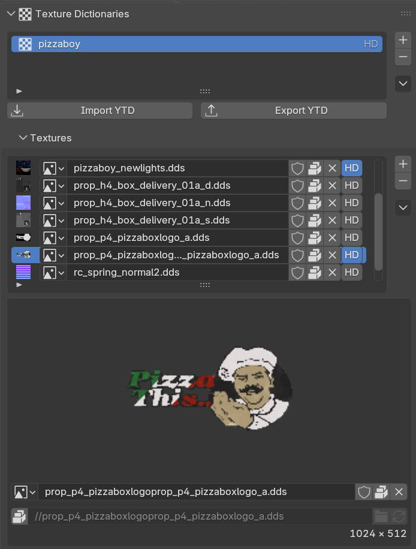
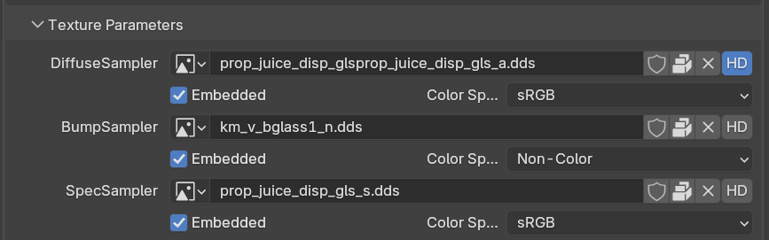

# 🖼️ Texture Dictionaries (.ytd)

Texture dictionaries contain textures that can be used by drawables or fragments. Compared to embedded textures, texture dictionaries allows you to share textures between multiple models and reduce asset file sizes.

The `Sollumz Tools > Texture Dictionaries` panel in the sidebar lets you create dictionaries and add or remove textures manually, or add _source_ mesh objects that automatically gather all images used by their Sollumz shaders, with a per-image toggle to control what gets included.

<figure><figcaption><p>Texture Dictionaries panel</p></figcaption></figure>

#### Sources

Sources let you reference Objects or Collections whose Sollumz shaders are scanned for textures, keeping the texture dictionary in sync with the textures actually used by your models.

The Images list shows every texture gathered from each source. Use the checkbox to control which of them are included in the texture dictionary. By default, embedded textures are excluded and non-embedded textures are included.

<figure><figcaption><p>Texture dictionary sources list</p></figcaption></figure>

#### HD Texture Dictionaries

HD texture dictionaries (+hi) can also be managed using Sollumz. Next to each textures there is an "HD" toggle. On export, textures marked as HD are exported to a +hi.ytd at full resolution, while the base .ytd contains half-resolution versions. For this, it is necessary for the textures to have mipmaps.

This also works with embedded textures on drawables, fragments, and drawable dictionaries: when HD textures are present, a +hidr.ytd/+hifr.ytd/+hidd.ytd is exported alongside the main asset.

<figure><figcaption><p>HD embedded textures</p></figcaption></figure>


Remember, HD texture dictionaries must be defined in your `_manifest.ymf`, under `HDTxdBindingArray`. For example:


```xml
<?xml version="1.0" encoding="UTF-8"?>
<CPackFileMetaData>
 <MapDataGroups itemType="CMapDataGroup" />
 <HDTxdBindingArray itemType="CHDTxdAssetBinding">
  <Item>
   <assetType>AT_DRB</assetType>
   <targetAsset>prop_bbq_2</targetAsset>
   <HDTxd>prop_bbq_2+hidr</HDTxd>
  </Item>
  <Item>
   <assetType>AT_FRG</assetType>
   <targetAsset>prop_flamingo</targetAsset>
   <HDTxd>prop_flamingo+hifr</HDTxd>
  </Item>
  <Item>
   <assetType>AT_TXD</assetType>
   <targetAsset>prop_mower</targetAsset>
   <HDTxd>prop_mower+hi</HDTxd>
  </Item>
 </HDTxdBindingArray>
 <imapDependencies itemType="CImapDependency" />
 <imapDependencies_2 itemType="CImapDependencies" />
 <itypDependencies_2 itemType="CItypDependencies" />
 <Interiors itemType="CInteriorBoundsFiles" />
</CPackFileMetaData>
```


