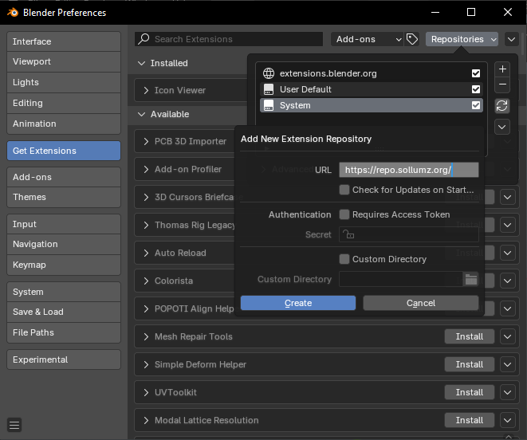
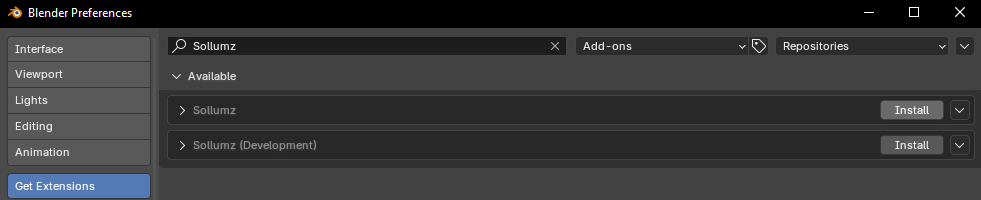
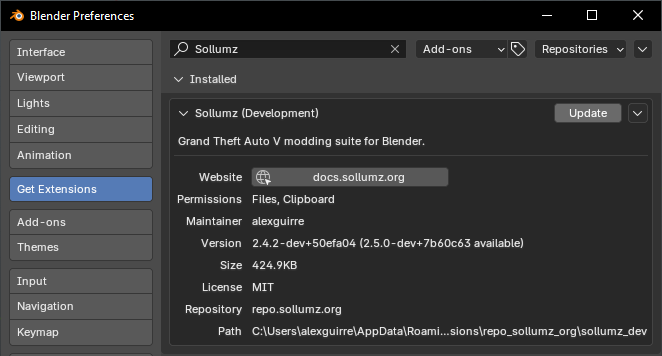

# 📥 Installation

## Blender 4.2+

Starting with Blender 4.2, Sollumz can now be installed as an extension from our repository [https://repo.sollumz.org/](https://repo.sollumz.org/).

First, add `https://repo.sollumz.org/` as a remote repository by navigating to `Preferences` > `Get Extensions` > `Repositories` > `+` > `Add Remote Repository`:

<figure><figcaption></figcaption></figure>

Next, search for "Sollumz". You will see two available versions to install:

1. **Sollumz**: The official release version, identical to what can be downloaded from the release page.
2. **Sollumz (Development)**: The latest development build, which may be unstable. Use this version to test new features and updates, and provide feedback to help us improve.

Choose your preferred version and click `Install`:

<figure><figcaption></figcaption></figure>

Once installed, you can easily update to newer versions directly within Blender. You will see an `Update` button whenever new versions are available.

<figure><figcaption></figcaption></figure>

## Previous Blender Versions

Download `Sollumz.zip` from the [latest release page](https://github.com/Sollumz/Sollumz/releases/latest).

Open Blender, go to `Edit` > `Preferences` > `Add-ons`

<figure><figcaption></figcaption></figure>

Click `Install...` and select the downloaded zip file.

Now enable the add-on by checking the checkbox.

<figure><figcaption></figcaption></figure>

Restart Blender.
