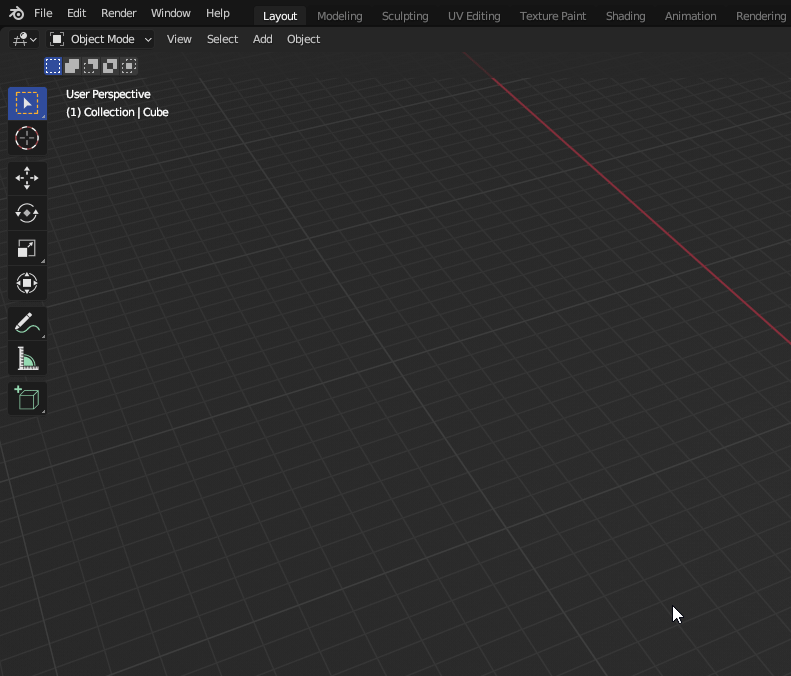

# 📥 Installation

Download [Sollumz](https://github.com/Skylumz/Sollumz/releases/latest).

Open Blender, go to `Edit` > `Preferences` > `Add-ons`

<figure><figcaption></figcaption></figure>

Click `Install...` and select the downloaded zip file.

Now enable the add-on by checking the checkbox.

<figure><figcaption></figcaption></figure>

Restart Blender.
