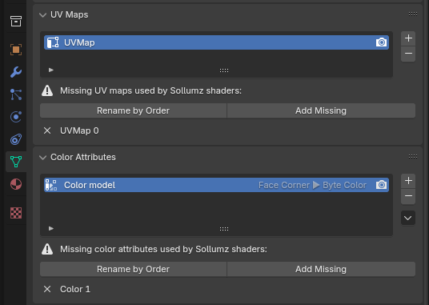

# ❔ FAQ

### How do I import files to Blender with Sollumz?

* Sollumz can only import XML files exported from CodeWalker. Make sure you install the latest version of CodeWalker as described[ here](../#requirements).

***

### When I import a YDR/YFT/YDD the textures are not loaded

* From the CodeWalker RPF Explorer, open the asset with the textures.
* Click the save icon in the top right, then click "Save All Textures"
* In Blender, press the `V` key, then click `Find Missing Files` and select the folder where you saved the textures.

<figure><figcaption></figcaption></figure>

* **Alternatively**, export all textures into a folder with the same name as the file you are importing. For instance, if you wanted to import `adder.yft` with all of its textures, you would export all textures to a folder called `adder` in the same directory. Then, when you import into Sollumz, all textures will be automatically loaded from the `adder` folder.

***

### My MLO shows up in CodeWalker but not in game.

* Make sure you generate a "\_manifest.ymf" file from the CodeWalker project window with your MLO, YMAP, and YTYP in it.

***

### I'm getting an error when importing a file.

* 9 out of 10 times it is due to having an outdated Sollumz version. Try updating.

***

### I'm getting the message `No Sollumz objects in the scene to export!` or `No Sollumz objects selected for export!`

* Check if the "Limit to Selected" export option is ticked. If so, only the selected objects will export.
* Make sure all of your objects have their sollum type set, otherwise, they will not be recognized by the add-on.
* As a last resort, you can select the parent object and use `Sollumz Tools > General > Debug > Fix Hierarchy`

***

### I'm getting the error `TypeError: create_uvsphere: keyword "diameter" is invalid for this operator.`

* Update your Sollumz.

***

### I'm getting the error `KeyError: 'bpy_prop_collection[key]: key "Image Texture" not found'`

* One of your materials has a missing node connection between Color node and an Image Texture, which is 100% needed in order to export the model.
* Check shading tab to find more.

***

### I'm getting the error `KeyError: 'bpy_prop_collection[key]: key "Principled BSDF" not found'`

* Only the Principled BSDF shader is supported during material conversion operations, anything else must be converted or recreated using Principled BSDF as base.

***

### I created a collision (external or embedded) but it isn't working.

* Remember to apply `General (default)` flags to your `Bound GeometryBVH` object from the `Sollumz Tools > Collision Tools > Flag Presets` menu.

***

### I'm having issues importing the file into OpenIV

* Since this plugin was designed around CodeWalker's XML file formats, OpenIV is not explicitly supported. You may experience issues going from Sollumz > CodeWalker > OpenIV. It's highly recommended that you just use CodeWalker.

***

### Why the vertices amount is doubled or tripled after exporting my model?

*   Vertices in Blender and in game meshes have different meaning. For Blender, it is basically just a position. For the game, it is position + attributes (normals, colors, UVs, etc). Closer to what Blender calls "Face Corners".\

    Don't think Blender shows the number of face corners anywhere without python, but after triangulization, it is basically number of faces\*3.\

    On export, Sollumz removes duplicate face corners when it can, when position and all its attributes are the same. So the final vertex count in the game mesh is somewhere between number of vertices and number of face corners.\

    Anyways, number of faces is more representative of the model quality/performance, so just use that, not vertices.

***

### My model is invisible after importing to CodeWalker

* Check the UV Maps and Color Attribute names, they have to follow the Sollumz naming convention. Sollumz is warning a user when names don't match.

<figure><figcaption></figcaption></figure>

***

## I try to import a XML but nothing happens!

Make sure the "Import To Asset Library" checkbox is unchecked and try to import again.\

<figure><figcaption></figcaption></figure>
