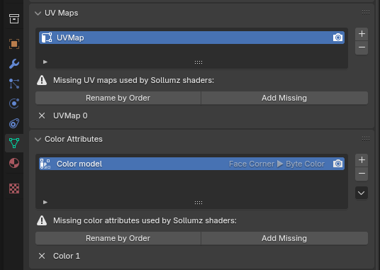
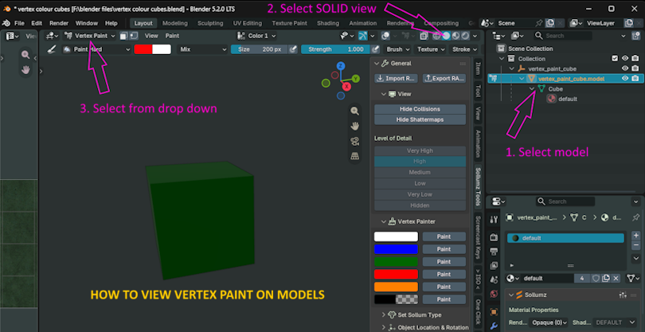
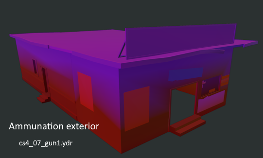
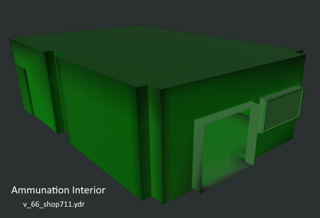

# ❔ FAQ

### When I import a YDR/YFT/YDD the textures are not loaded

* From the CodeWalker RPF Explorer, open the asset with the textures.
* Click the save icon in the top right, then click "Save All Textures"
* In Blender, press the `V` key, then click `Find Missing Files` and select the folder where you saved the textures.

<figure><figcaption></figcaption></figure>

* **Alternatively**, export all textures into a folder with the same name as the file you are importing. For instance, if you wanted to import `adder.yft` with all of its textures, you would export all textures to a folder called `adder` in the same directory. Then, when you import into Sollumz, all textures will be automatically loaded from the `adder` folder.

***

### My MLO shows up in CodeWalker but not in game.

* Make sure you generate a "\_manifest.ymf" file from the CodeWalker project window with your MLO, YMAP, and YTYP in it.

***

### I'm getting an error when importing a file.

* 9 out of 10 times it is due to having an outdated Sollumz version. Try updating.

***

### I'm getting the message `No Sollumz objects in the scene to export!` or `No Sollumz objects selected for export!`

* Check if the "Limit to Selected" export option is ticked. If so, only the selected objects will export.
* Make sure all of your objects have their sollum type set, otherwise, they will not be recognized by the add-on.
* As a last resort, you can select the parent object and use `Sollumz Tools > General > Debug > Fix Hierarchy`

***

### I'm getting the error `TypeError: create_uvsphere: keyword "diameter" is invalid for this operator.`

* Update your Sollumz.

***

### I'm getting the error `KeyError: 'bpy_prop_collection[key]: key "Image Texture" not found'`

* One of your materials has a missing node connection between Color node and an Image Texture, which is 100% needed in order to export the model.
* Check shading tab to find more.

***

### I'm getting the error `KeyError: 'bpy_prop_collection[key]: key "Principled BSDF" not found'`

* Only the Principled BSDF shader is supported during material conversion operations, anything else must be converted or recreated using Principled BSDF as base.

***

### I created a collision (external or embedded) but it isn't working.

* Remember to apply `General (default)` flags to your `Bound GeometryBVH` object from the `Blender Side Bar > Object > Flag Presets` menu.

<figure><figcaption></figcaption></figure>

* If you have created a separate collision model (ybn) from your drawable model, you need to apply the world coordinates to the poly\_mesh.

<figure><figcaption></figcaption></figure>

***

### I'm having issues importing the file into OpenIV

* Since this plugin was designed around CodeWalker's XML file formats, OpenIV is not explicitly supported. You may experience issues going from Sollumz > CodeWalker > OpenIV. It's highly recommended that you just use CodeWalker.

***

### Why the vertices amount is doubled or tripled after exporting my model?

*   Vertices in Blender and in game meshes have different meaning. For Blender, it is basically just a position. For the game, it is position + attributes (normals, colors, UVs, etc). Closer to what Blender calls "Face Corners". 

    Don't think Blender shows the number of face corners anywhere without python, but after triangulization, it is basically number of faces\*3. 

    On export, Sollumz removes duplicate face corners when it can, when position and all its attributes are the same. So the final vertex count in the game mesh is somewhere between number of vertices and number of face corners. 

    Anyways, number of faces is more representative of the model quality/performance, so just use that, not vertices.

***

### My model is invisible after importing to CodeWalker

* Check the UV Maps and Color Attribute names, they have to follow the Sollumz naming convention. Sollumz is warning a user when names don't match.

<figure><figcaption></figcaption></figure>

UV Maps and Color Attribute should be changed to the following

<figure><figcaption></figcaption></figure>

***

## I try to import a XML but nothing happens!

Make sure the "Import To Asset Library" checkbox is unchecked and try to import again. 

<figure><figcaption></figcaption></figure>

***

#### I have embedded or linked a ytd to my model but it doesnt show.

Sollumz required textures to be added to shaders. (see Creating Static Meshes)

The texture must be a .dds file. (png, bmp etc will not work.)&#x20;

The dds must be 'power of 2' ie 512x512, 128x64 etc. You can use any graphics software to edit the size as long as it saves in dds format with mipmaps and as a dtx1 for models.

Maximum recommended size for textures is 2048 to ensure your model is optimised. Download textures from the game for examples and use on your models.

For Clothing textures, see&#x20;



***

## Why can't I see CodeWalker XML to import or export files?

Sollumz can now import and export native files as well as XML files. These are referred to as RAGE (Rockstar Advanced Game Engine) assets. This allows you to directly import files without exporting as XML.

For example: db\_apart\_06.ydr or db\_apart\_06.ydr.xml\
\
There is the option in the export window to choose native or CW XML for Legacy (Gen8) or Enhanced (Gen9). Note, some files will still be required to be imported as XML.

<figure><figcaption></figcaption></figure>

***

## Why do my props glow in game at night?

VERTEX PAINTING is required for game assets self-illumination and lighting to show properly by reacting to ambient and moon light.

A prop will glow a pinkish red colour at nightime, or be dark or black in an mlo if it has not had vertex paint applied.

Vertex painting is only one component of modelling. Proper modelling to display assets depends on things like textures, timecyles and vertex paint among other parameters.

The very basic rule for Vertex Painting is GREEN for inside MLOs, and RED for outdoors.

Basic Guide to Paint

<figure><figcaption></figcaption></figure>

<figure><figcaption></figcaption></figure>

<figure><figcaption></figcaption></figure>

Vertex paint is not usually one colour. A mix of colours and gradient provides the best result for lighting in game. Below are some examples of the Ammunation building, both interior and exterior shells.

<figure><figcaption></figcaption></figure>

<figure><figcaption></figcaption></figure>

