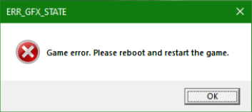

# 🏭 Asset conversion for GTAV Enhanced

In this tutorial, you will learn how to convert your assets from the Legacy version of Grand Theft Auto V to Enhanced, released in 2025.

### What will you need

* CodeWalker30\_dev48 or newer version (available at [https://discord.gg/codewalker](https://discord.gg/codewalker), #releases channel)
* Legacy assets from mods (.ydr. .yft, .ytd, .ydd files are supported)
* OpenRPF for Enhanced [https://www.gta5-mods.com/tools/openrpf-openiv-asi-for-gta-v-enhanced](https://www.gta5-mods.com/tools/openrpf-openiv-asi-for-gta-v-enhanced)


Double make sure you are using the CodeWalker 30 dev48 or newer version.


### Utilizing the Asset Converter

1. Prepare the folder with your Legacy assets&#x20;

<figure><figcaption>
Files of Adder vehicle in Legacy format
</figcaption></figure>

2. Create a folder for Enhanced assets (in this example - **gen9**)

<figure><figcaption></figcaption></figure>

3. Open up CodeWalker RPF Explorer, and head to Asset Converter

<figure><figcaption>
Opening Asset Converter via Tools\Asset Converter
</figcaption></figure>

4. Select a folder with Legacy files

<figure><figcaption>
Selecting a folder with Legacy files
</figcaption></figure>

5. Select a folder to save converted files

<figure><figcaption>
Selecting a folder to convert files for Enhanced
</figcaption></figure>

6. Untick **Include subfolders** and click **Process**

<figure><figcaption>
Conversion process
</figcaption></figure>

And it's done! Conversion process was completed and your mod is ready to be used in Enhanced.

***

### OpenRPF

In order to use modified files in the Enhanced version, an OpenRPF file loader is needed. \
Installation process is very simple.

1. Download OpenRPF from the link on the top of this tutorial.
2. Extract ZIP archive.
3. Select dsound.dll and OpenRPF.asi and drag\&drop them to GTAV Enhanced installation folder

<figure><figcaption>
OpenRPF installation process
</figcaption></figure>

***

### Troubleshooting

There is no rose without thorns, especially in game modding. Some unexpected behaviours can occur when porting content to Enhanced.

#### ERR\_GFX\_STATE

<figure><figcaption></figcaption></figure>

**Q**: My car is spawned, when I'm entering the car, I got **ERR\_GFX\_STATE** crash.\
**A**: The issue is in the texture inside .ytd file. A texture starting with `script_rt_` name is saved in incorrect format. For such file, only `D3DFMT_A8R8G8B8` is expected by game.

<figure><figcaption>
DXT5/BC3 texture format is the wrong one
</figcaption></figure>

To fix this issue:

1. Extract texture to .dds

<figure><figcaption>
Process of extracting texture from .ytd file
</figcaption></figure>

2. Open texture in image editor supporting editing .dds files (i.e. GIMP)
3. Save the texture using **RGBA8** texture format, without mipmaps.

<figure><figcaption>
Example of saving texture in GIMP
</figcaption></figure>

4. Replace texture by the saved one from moments ago and save file.

<figure><figcaption>
Process of replacing texture
</figcaption></figure>

**Q**: Game crashed even when I didn't enter the car.\
**A**: Check the material/geometries amount of the converted vehicle. GTAV Enhanced **has a limit of 128 materials/geometries** per file and exceeding that value leads to crashes.\

<figure><figcaption>
vacca_hi vehicle with more than 128 materials
</figcaption></figure>

A plausible workaround for that issue is to export \_hi.yft and .yft files to .XML, import them using Sollumz, export to .XML and import these files by CW RPF Explorer.\
\
1\. Select files in CW RPF Explorer, click right mouse button and select Export XML button.

<figure><figcaption>
Exporting files to XML format
</figcaption></figure>

2. Import XML file in Blender using Sollumz

<figure><figcaption>
Importing process
</figcaption></figure>

3. Select the root component from the Layers menu and Export CodeWalker XML

<figure><figcaption>
Exporting process
</figcaption></figure>

4. In CW RPF Explorer, click right mouse button and select Import XML button and select both exported from Blender.

If this process didn't reduce material/geometries amount, then vehicle mod isn't well optimized for games and ask mod author about fixing it for GTAV Enhanced.
