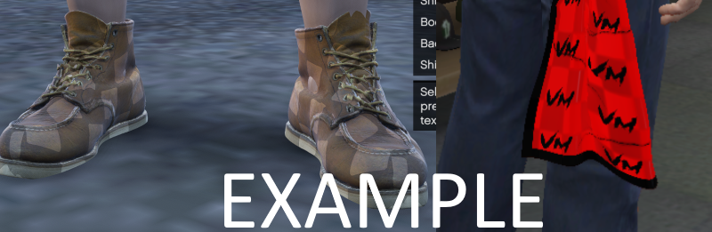

# 👕 Basic Clothes Editing

Often the easiest way to get into ped editing is to start simple: Let's edit an existing model from GTA for a freemode ped, so we can learn the basics.

## Peds: Streamed vs Non-Streamed

One thing you should know is that there are generally two different types of peds for GTA: "streamed" and "non-streamed". For a basic explanation, just know that peds use YDD (drawable dictionary) files for their models instead of YDR. For streamed peds, all of their 'parts' (ie shirt, shoes, head, etc) are separate YDDs. For non-streamed peds, all of those parts are put together into 1 single YDD. Streamed peds are generally easier for beginners to start with editing, because you can edit and export 1 piece at a time so if you mess up, you know it's just that 1 part that isn't working.

MP Freemode both male and female are both "streamed peds". This means that all of their parts are separate. If you wanted to see a 'base body' in blender to work with, you'll need to import several different YDDs: a HEAD, an UPPER, a LOWR, and a FEET.&#x20;

## Ped Skeletons

One other note before we start: All peds, whether streamed or non-streamed, have a SEPARATE FILE called a YFT for their skeleton. For whatever ped you are editing with Sollumz, you will need their YFT file so that Sollumz knows what their bones are.

## Importing the Files

#### Export the skeleton YFT XML

Let's start getting ready to get into Blender! The first step is to export the male and female Freemode ped skeletons (YFTs) to use when importing and exporting components that are rigged to the ped. These are located at **x64v.rpf\models\cdimages\streamedpeds\_mp.rpf** and can be saved separately to be used with any freemode ped clothing or accessories you edit in the future.

<figure><figcaption>
an image of codewalker showing the folder where mp m/f yfts can be found
</figcaption></figure>

If you haven't already created a folder somewhere on your computer to work on this project, do that now. Then, right-click the **mp\_m\_freemode\_01.yft** and press `Export XML...`. Make sure you're keeping track of where you exported the XML to. It will need to be in the same folder as the YDD when we import into Sollumz.

#### Exporting the YDD

Now we'll export the model we actually want to edit, as well as a texture for it. If you didn't already know of it, [tobii.space](https://tobii.space/) is a good visual reference for most of the freemode components. It has most DLC clothing, although it is missing some of the newer updates. Today we already know what clothing piece we're using, so let's head back over to Codewalker RPF and grab the file.

Open up CW RPF and type `mp_m_freemode` into the searchbar

<figure><figcaption></figcaption></figure>

If you click "Name" at the top to sort by name, you'll then see a list of all of the MP Male folders. You'll notice there are multiple folders for every DLC. This is the original DLC folder, and then patchday folders that hotfixed any issues R\* had with various pieces of clothing.

<figure><figcaption></figcaption></figure>

The 🟥 outline is all of the base MP male DLC folders

The 🟧 outline highlights all of the DLC names. Notice the original DLC and all of the patchday hotfixes.

The 🟩 outlines the original base game DLC folder.

Right now we aren't going to worry about any hotfixed files, so just click into the original DLC folder. If you are ever editing GTA assets, though, you should always look through the patchday folders for whatever component you're trying to edit so that you can work off of the most up-to-date version.

Now that we're inside the base folder, you'll see a long list of all the base game components and their YTD textures. Make sure you're sorted by 'Name' so that everything is alphabetical, and then scroll down until you see the JBIBs.&#x20;

For the purposes of our tutorial, let's export `jbib_007_u`.&#x20;

1. Right-click on `jbib_007_u.ydd`
2. Select `export XML...`
3. Export location: **Make sure you export to the same folder** you exported the YFT earlier.

<figure><figcaption></figcaption></figure>

Now let's quickly visit the folder you've just exported the file to. In the folder, you should have a couple of things. Firstly the `mp_m_freemode_01.yft.xml`, then `.ydd.xml` of our jbib & there should also be a folder named `jbib_007_u`.

Whenever you are exporting a model that **has embedded textures**, Codewalker RPF will create a folder named after the model you exported to XML with all of the embedded textures placed inside of it.&#x20;

Go ahead and click into the folder and take a peek at the embedded textures!  You should see two: a **normal** texture and a **specular** texture. To quickly explain these: A normal helps emphasize clothing details like wrinkles & a specular helps display the glossiness or matte of your clothing.

Most freemode clothing components have an embedded specular texture and normal texture. When you go to make your own models later on, you'll need to learn how to create these yourself. For now, they have already been made for us. So get familiar with them while you can!

#### Exporting a texture for our model

You might have already noticed, but there's one texture we don't have yet: A diffuse texture. The diffuse texture for clothing YDDs stays un-embedded from the model and in a separate file called a  YTD (texture dictionary), and you can have up to 26 of them (A to Z) for any single YDD. We _don't  need_ the texture for our editing today, but it's nice to have a visual reference, so let's grab one now.

In Codewalker RPF right below where you found the YDD we exported, should be the YTD files. Scroll down until you see `jbib_diff_007_a_uni.ytd` and export it to XML. It will create a sub-folder named **jbib\_diff\_007\_a\_uni** with the texture inside of it.

### Ready for Blender

Do a final check before opening blender. Your folder should look like this:

<figure><figcaption></figcaption></figure>

Your `.yft.xml` is in the same folder on the same level as the `.ydd.xml` . That's the import part!

If you would like, you can copy/paste the diffuse texture from the **jbib\_diff\_007\_a\_uni** to the "embedded textures" folder **jbib\_007\_u** . This will allow Sollumz/Blender to automatically find the texture when you go to import. Otherwise, you can link it manually later on.

## Importing to Sollumz

With Blender open:

1. click File
2. Import ► Codewalker XML
3. Navigate to the folder you exported the XMLs
4. Click **jbib\_007\_u.ydd.xml** and from the side-menu options make sure you select 'Import External Skeleton'

<figure><figcaption></figcaption></figure>

You should now be looking at something like this:

<figure><figcaption></figcaption></figure>

Let's make sure we imported correctly. In scene collection:

1. Expand **jbib\_007\_u** and then **jbib\_007\_u.001** and click on **SKEL\_ROOT**&#x20;
2. In the properties window, click on the Object Data Properties tab
3. Expand Vertex Groups (if its not already) and make sure they are all named.&#x20;

<figure><figcaption></figcaption></figure>

If you see named bones like **SKEL\_L\_Hand** etc then you're good to go! If you see something like UNK.001 you did not follow the correct steps for exporting the YFT portion of this tutorial. Go back up, re-read, and try again.

## Preparing the model

#### Viewport adjustments

With everything imported properly, let's get ready to actually edit! First things first, we probably want to change our viewport to actually see what we're working with.&#x20;

<figure><figcaption></figcaption></figure>

Personally, I like to change the 'color' to Texture and 'lighting' to MatCap, but you can play around in this menu and see what works for you.

#### Linking diffuse texture

Once we have that set, your shirt might look like this:

<figure><figcaption></figcaption></figure>

If you left the diffuse texture in it's own **jbib\_diff\_007\_a\_uni** sub-folder, you'll see our jacket is pink. That's fine! We can just link up our diffuse texture now.

* Top-left, go to File ► External Data ► Find Missing Files

<figure><figcaption></figcaption></figure>

Navigate to your project folder and select the **jbib\_diff\_007\_a\_uni** sub-folder where you will see the **jbib\_diff\_007\_a\_uni.dds**. Then press 'find missing files'.&#x20;

<figure><figcaption></figcaption></figure>

It's good to know this method, as you will use it in other parts of Sollumz modding as well for things like props and MLOs. You might see a yellow warning popup at the bottom of your blender that says it cannot find 'givemechecker.dds' . This is fine to ignore.

<figure><figcaption>
you can ignore this warning
</figcaption></figure>

Head back to the 3D viewport (instead of shader editor) and we can see our jacket now has the diffuse texture:

<figure><figcaption></figcaption></figure>

Great! Just one more thing to do before we actually edit. When importing into blender our vertices have unmerged and we've lost our sharp edges. We want all of that back so that we can have the most accurate view of what we're working with and what it will look like in-game.&#x20;

#### Merge vertices/Sharp Edges

To fix things, let's do the following:

1. Select SKEL\_ROOT in scene collection
2. In 3D Viewport, Tab into Edit Mode
3. Select everything (Default: A key)
4. Merge ► By Distance (Default: M key)
5. In the bottom left for the 'Merge by Distance' window, expand it and tick on Sharp Edges

<figure><figcaption></figcaption></figure>

Clothing has 3 LODs (level of detail): high, medium, and low. We also need to do the same thing for our medium and low LODs.&#x20;

The easiest way to switch between LODs quickly is to press **SHIFT + V** (make sure you are no longer in edit mode) to bring up the Sollumz Object Visibility wheel.

<figure><figcaption></figcaption></figure>

The three options on the right-side of the wheel are the ones you'll be using for clothing YDDs. Switch to Medium, repeat the same steps above. Then switch to Low, and do it once more.&#x20;

## Editing

We're ready to edit! Switch back to High LOD with SHIFT + V and tab into edit mode. You can make any changes you want here. I'll delete the sleeves for the purpose of this tutorial.

<figure><figcaption></figcaption></figure>

Now that I've removed the sleeves, I have 2 things to resolve:

1. I need to fill in the holes where the sleeves used to be
2. I need to create new sharp edges to tidy up the model

The reason we want to fill in the holes is because GTA uses back-face culling. What this means is that the faces on the model do not have both a viewable "front" and "back". Instead, the front-facing side is visible and the back is invisible. We can see this in action in blender by going back up to the viewport shading options and turning it on.

<figure><figcaption></figcaption></figure>

You can see the "back side" of the model is invisible now. We need to fill in those holes. There are two ways to fix this.

First, go back into edit mode and select all of the vertices around the edge.

<figure><figcaption></figcaption></figure>

Then you have two options. You can either press F to fill in the hole, or you can extrude the hole and then merge the vertices from the extrusion. For this tutorial, I'll be doing the second method.

<figure><figcaption></figcaption></figure>

1. Select the vertices around the edge
2. Extrude (default E key)
3. With your mouse, move the new points slightly inward
4. Scale the vertices together (default S key) then merge them (M Key) ► at center

You might notice that our new geometry looks a little weird. Almost as if its shiny in places.

<figure><figcaption>
an example of bad normals
</figcaption></figure>

What's happening here is we have bad normals. To be clear, there is a difference between the embedded "normal texture" (sometimes also called a bump map) and geometry normals. If you'd like to learn more about normals, there are plenty of youtube videos that can help.&#x20;

For now I'm just going to reset them to clear up this issue! **With my geometry selected** go to Mesh ► Normals ► Reset Vectors

<figure><figcaption></figcaption></figure>

Once that's done, everything should be looking much betterr.

<figure><figcaption></figcaption></figure>

Since this is the edge of the shirt, I'd also like to set some sharp edges along the same loop we just filled in. Sharp edges add a more "crisp" line in geometry that is clearly visible in-game. When you use them properly, they can add a little extra emphasis to your model quality. There's no rule of when or when not to use sharp edges, it's up to you to follow the lines of clothing and determine where they would make sense.&#x20;

For now I'll go to edge select & select the loop I filled in, then right-click and press "mark sharp"

<figure><figcaption></figcaption></figure>

Now do the same thing with the other side.&#x20;

<figure><figcaption></figcaption></figure>

With that done comes the boring part: Repeating the same process with the medium and low LODs! With custom models, you would have all of this already finished before you create your LODs  but when editing existing clothing, you need to either edit everything the same or create new LODs after you've edited.

For this tutorial, you should delete the sleeves on the med/low LODs so that they look visually similar, but it's up to you whether you want to fill in the sleeve holes like we did here for High LOD. Chances are that from a distance people won't be able to see that small detail anyway.

## Exporting

With all of the LODs edited, we're now ready to export!&#x20;

* In the outliner window, right-click **jbib\_007\_u** and `select hierarchy`

<figure><figcaption></figcaption></figure>

* Then go top-left to File ► Export ► Codewalker XML
* It's best to create an 'export' folder so that you are not overwriting the original. That way if you mess up, you don't have to go grab the ydd xml all over again.&#x20;
* navigate into Export folder
* Export

<figure><figcaption></figcaption></figure>

The window will close and at the bottom of your blender you should see a message like "exported in 0.12 seconds".&#x20;

Now in our export folder, we should have our new .ydd.xml and a copy of the embedded textures folder with our normal/specular textures inside.&#x20;

<figure><figcaption></figcaption></figure>

You can now head back over to Codewalker RPF and import the XML to turn it back into a YDD & preview it!

<figure><figcaption></figcaption></figure>

Our model is finished! Now you can replace the existing one or create an addon with the same textures and test in-game. In-game you might see it clips with the underarms as you move around. That's due to something called "weight painting". More about that to come in future tutorials!

## FAQ

### What Vertex Colors should I use?

99% of the time you want Color 1 to be #FF8000 and Color 2 to be #000 with 0 alpha.&#x20;

<figure><figcaption></figcaption></figure>

Color 1 setup:

<figure><figcaption></figcaption></figure>

Color 2 setup:

<figure><figcaption></figcaption></figure>

Make sure both are set to "face corner" and "byte color":

<figure><figcaption></figcaption></figure>

### My clothes are shaking ingame

**Answer**: This has to do with Vertex Colors. Color 1 determines the lighting a ped object should take on, and Color 2 is to deal with sweat or wind effects. Your clothes are shaking due to wind. To turn off wind effects, set the alpha on Color 2 to 0.&#x20;

<figure><figcaption></figcaption></figure>

### The shading on my clothes are weird, it's completely black on one side/in the shade.

**Answer**: This has to do with Vertex Colors. Color 1 determines the lighting a ped object should take on. Most MP clothing uses hex color #FF8000 for Color 1 (#000 with no alpha for Color 2, see above)

### My clothes look shiny/oily in the sun

**Answer**: This has to do with Vertex Colors. Color 1 determines the lighting a ped object should take on, and Color 2 is to deal with sweat or wind effects. Your clothes are shiny in the sun due to sweat. To turn off sweat effects, set Color 2 to hex #000 (with 0 alpha to also disable wind effects as stated above).&#x20;

### There's a weird checkered pattern on top of my clothing texture

<figure><figcaption></figcaption></figure>

**Answer**: For MP Freemode YDDs using PED material (or streamed ped YDDs) it is required to embed both a normal and specular texture(s). If you see your texture but with a checkered overlay, most likely you are missing one or both.

### My YDD exported but doesn't appear ingame

**Answer**: Most of the time this is due to clothing not being rigged. Either you did not import with external skel (see [#importing-the-files](basic-clothes-editing.md#importing-the-files "mention")) or your import was okay but you didn't actually rig your mesh (empty vertex groups).&#x20;

### My \_r freemode clothing piece is not changing skin colors ingame

**Answer:** Several things could be wrong. Either you:

* Did not name your embedded textures correctly (should follow R\* format so `component_normal/spec_number` for example: `jbib_normal_000` and `jbib_spec_000`)
* The alpha RGB channel on your specular texture (viewable in programs like photoshop) is not setup correctly
* You moved the UVs for the skin (you should not do this)
* Your diffuse is not square or not Power-of-2 (256x256 or 512x512 etc). \_r clothing should be square to follow original MP skin dimensions.

This is an intermediate problem that has many possible issues. For a more in-depth explanation of these problems (and a walk-through of the solutions) please watch this video:


