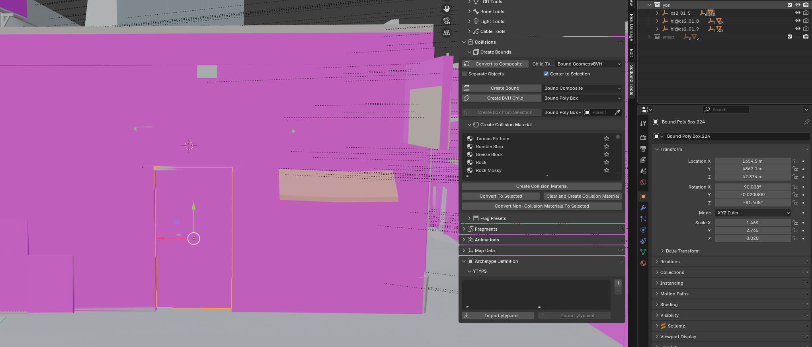
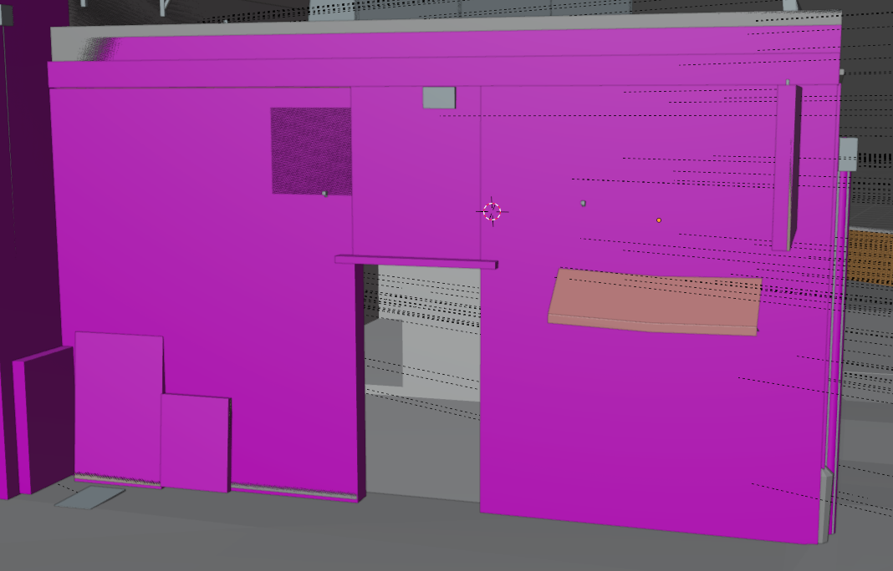
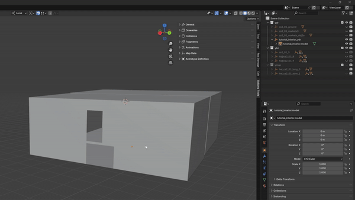
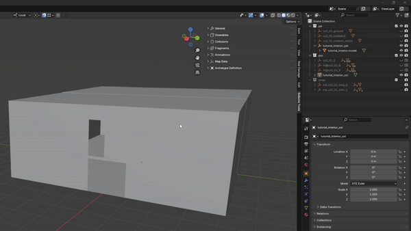
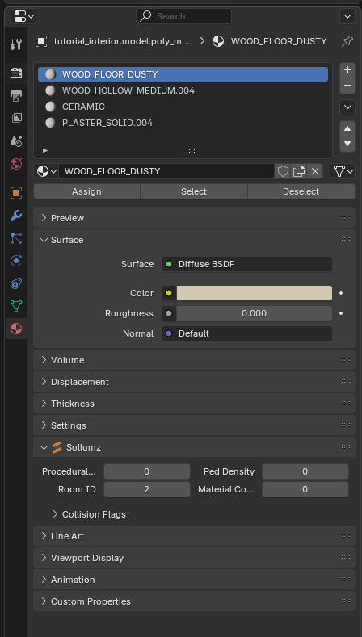

# Collisions

Now we need a collision so the player can walk inside the interior without falling through the walls and floor. Let's start with opening of the building collision.

## Edit the ybns

Go and show every ybn that are where there is a doorway and edit it so there is a hole inside to the interior. Remember to take the camera inside the interior to see if there is any collision that needs to be moved/deleted.

<figure><figcaption></figcaption></figure>

Like that we now have removed the collision so the players actually can go inside the interior.

<figure><figcaption></figcaption></figure>

## Create the ybn

The easiest way to do it is to make a copy of the shell and then convert it to a ybn, but before you just convert then export you'll need to assign the material so the footsteps and gun shots wil behave as intended.

To make a copy of the shell just press `SHIFT+D` and then right click and then `ALT+P` move the duplicated shell out of the drawable so it can be made to a ybn.

<figure><figcaption></figcaption></figure>

Now that we have made a copy it needs to be converted to a Composite you do that by marking the mesh and pressing `V` and selecting the option convert to Composite and then the option Apply flag preset

<figure><figcaption></figcaption></figure>

## Collision material

You are now ready to assign the material to the collision. Here you just need to find the material that is closest to what material you have chosen on the drawable, and then it's just assign them the same way as the texture.

The floor material need to be different for each room so the room ID can be set to the material

<figure><figcaption></figcaption></figure>
