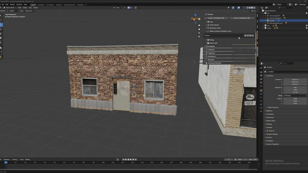
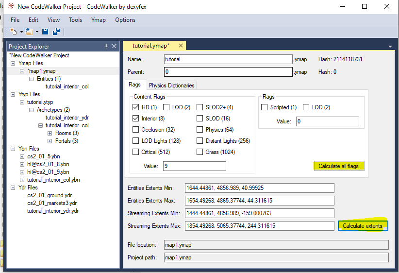
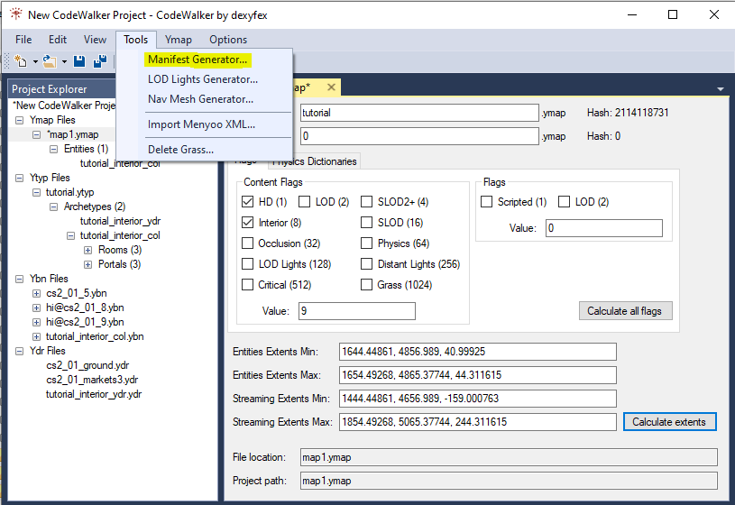

# Creating ymap

Now we are at the last step of the interior tutorial the only thing we need is to place the interior into the world.

Start by opening the folder where all your files are located so the files wil be loaded into the game. Open the navbar and press open folder.

<figure><figcaption></figcaption></figure>

When you have opened the folder everything should be in the project manager, and it is now time to add the ymap. Go add the ymap and a new entity and replace `prop_alien_egg_01` with the name of the interior as defined in the ytyp in this tutorial I called it `tutorial_interior_col`.

<figure><figcaption></figcaption></figure>

Now it is time to place it the right place, and it is now that the mirror we created earlier come in handy. Select the model in blender and open `General > Object Location & Rotation Tools` and press the most left button to copy the coordinates to clipboard the go into CodeWalker and paste the coordinates into the project manager.

<figure><figcaption></figcaption></figure>

Now it's time to calculate the flags and extents by selecting the ymap and press the calculate buttons and here you can also name the ymap what you want to call it in the name field then save the ymap.

<figure><figcaption></figcaption></figure>

We are almost done we are just missing the manifest file which we can auto generate by pressing Tools and the generate manifest and then save.

<figure><figcaption></figcaption></figure>

Now we are ready to load everything into the game.
