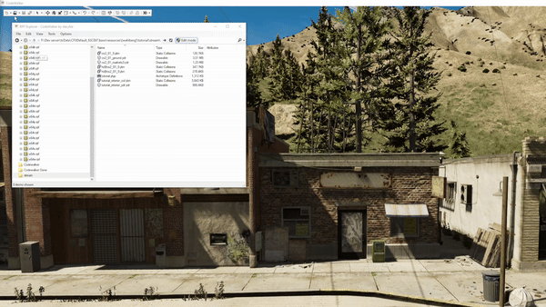

# Creating ymap
Now we are at the last step of the interior tutorial the only thing we need is to place the interior into the world.

Start by opening the folder where all your files are located so the files wil be loaded into the game. Open the navbar 
and press open folder.
<figure><figcaption>

</figcaption></figure>

When you have opened the folder everything should be in the project manager, and it is now time to add the ymap. Go add 
the ymap and a new entity and replace `prop_alien_egg_01` with the name of the interior as defined in the ytyp in this 
tutorial I called it `tutorial_interior_col`