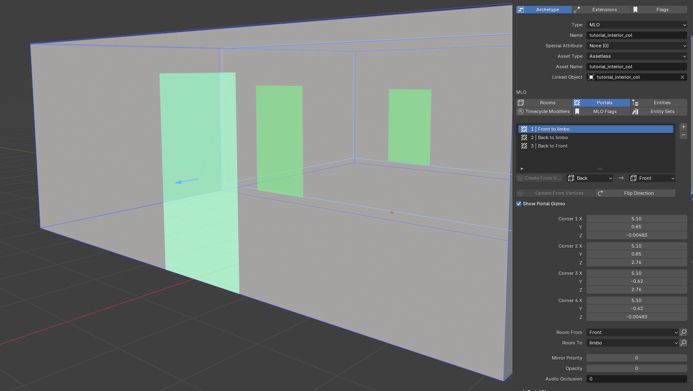

# Creating ytyp
So now we have a somewhat finished model now it is time to make the archetype (.ytyp). The archetype is a file that contains
information about the model, collision, and texture it is also in the file we determine how many rooms there are and
where the portals between rooms are and entities in the room (This **_can_** be easier to do in CodeWalker later on), it is
also time to create the map data (.ymap) this is where we place exterior entities (Again this **_can_** be easier to do in
CodeWalker later) and in the interior we defined in the archetype. There are ways to do it directly inside of Blender, but
it is not part of this tutorial check out [this video by ook3D](https://www.youtube.com/watch?v=P8Pxe6Z_iwQ&ab_channel=ook_3D)
if you want to know more.

## Set model back to world origin !! Sæt den her til før man modelere !!
We now need to set the model to origin, but we don't just set it back but make a mirror and send the original back to 
world origin. To make a mirror of the object we selected just press `ALT+D` and then right click to make it go to the 
original model. Now that we have a copy of the model we can drag the model out of the drawable and then move the drawable 
to world origin you'll now have the model at the location and at world origin. The mirror will be used to get the 
location so when we need to create the ymap it will be at the exact same place as in blender you can therefore rename 
the mirror to "Location" or whatever you want it doesn't really matter what the name is.

## ytyp
Start by opening `Sollumz Tools > Archetype Definition > YTYPS` and then press the `+` icon to create a new archetype then
you can mark every item you have made just the drawable then make sure it is set to base then press Auto-Create From Selected then
mark the collision change to MLO and then press Auto-Create From Selected again you now have the definition of every drawable
and the MLO where the portals are defined.
<figure><figcaption>

</figcaption></figure>

Now we want to create the rooms for every room + limbo, first select the mlo and open the tab Rooms now we add the first 
room witch is the limbo room it is created by pressing the Create Limbo Room, now the rest of the rooms will be added by 
pressing the `+` foreach room you'll need in this tutorial, then we just need 2 one for the front room and one for the back room.
Then to fit the room select the collision and open edit mode and select the 4 vertices and press the button Set Bounds From Selection
<figure><figcaption>

</figcaption></figure>

Now it is time for portals. Go to the Portals tab and mark the 4 corners of the doorway and make the portal from **_inside_** to **_outside_**,
when inside it doesn't really matter what way they are facing. When the portal is set make sure the direction of the 
arrow in the portal faces the same way as the instructed and if not use the Flip Direction button to flip so the arrow match.
<figure><figcaption>

</figcaption></figure>


It is very important to go out from inside when limbo is one of the parts
Room -> Limbo


Now to add the shell as an entity, navigate to the Entities tab and select the drawable and press the Add Object(s) as Entity, 
and it will be added now just add the room limbo to the entity
<figure><figcaption>

</figcaption></figure>

We are now done with the archetype there are much more to know about the archetype you can read more about it [here](../../documentation/archetype-definition.ytyp/README.md)
There is also much more to discover here you can play around with the timecycles and flags on room and portals these can
also be done in CodeWalker
