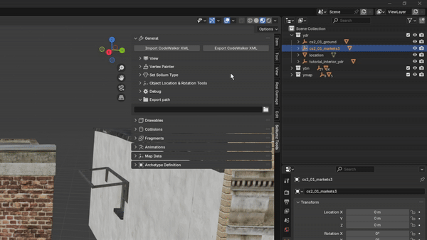
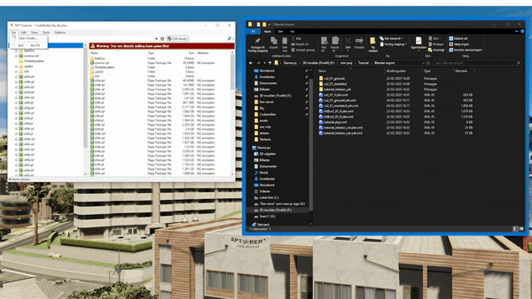

# Export from Blender
To export you just need to select every item you want to export and open Sollumz tool and press export do note that 
you can only export one thing at a time. Note that the object need to be visible to be exported so make sure that 
everything you want to export is not hidden.
<figure><figcaption>

</figcaption></figure>

We now need to convert the xml to gta formats we de that by opening the RPF Explore and then open a folder you want the 
files to be in and drag the xml file into the RPF Explore.
<figure><figcaption>

</figcaption></figure>
