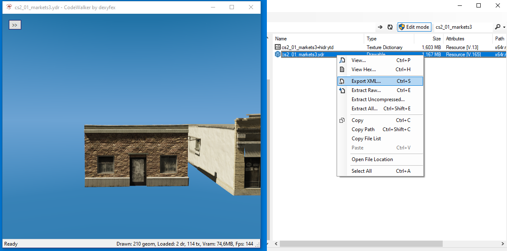
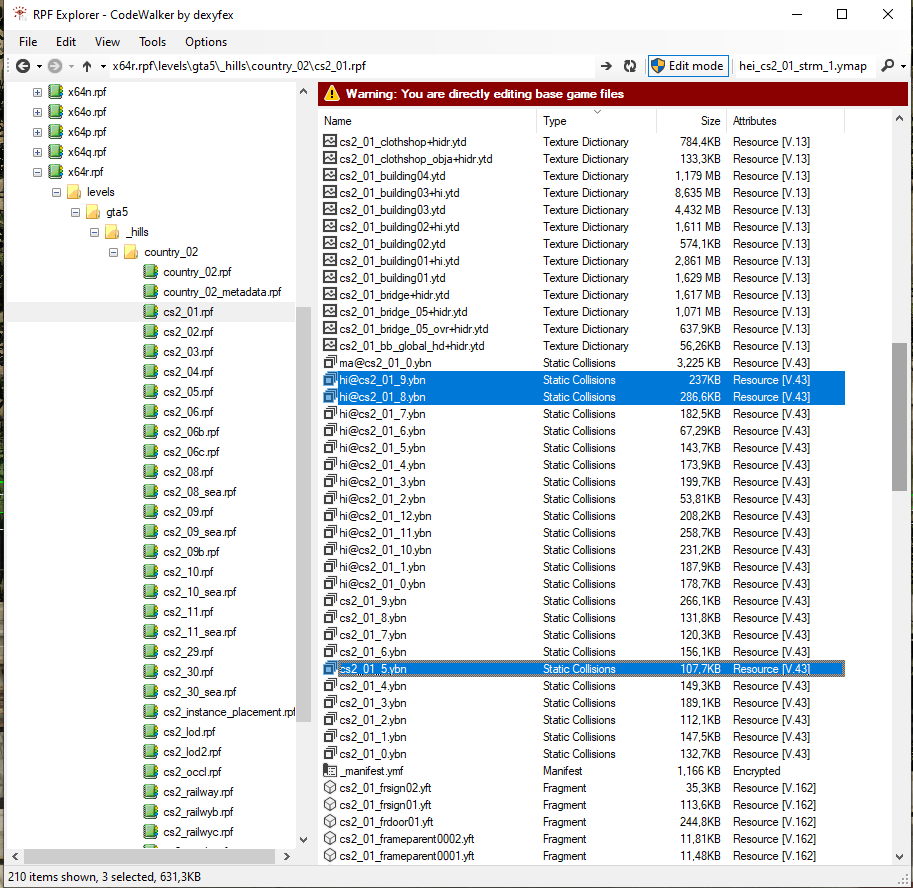
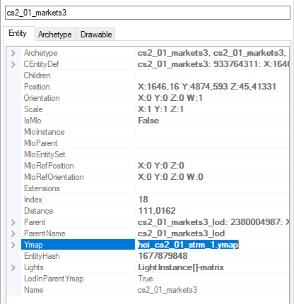
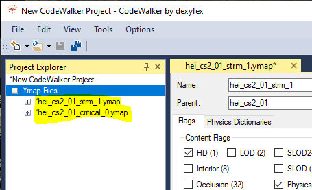

# Importing from CodeWalker

## Drawables

When you have found the building and selected it, copy the name from the right hand side and search in the files using the RPF Explorer from the tool menu

<figure><figcaption></figcaption></figure>

To export from CodeWalker we need the xml file before you export it you can open the file to ensure it is the right one, and we get that by right-clicking and pressing export to xml.

<figure><figcaption></figcaption></figure>

To get every texture use the >> to find the textures and save them to the folder of the building name so when we load the model into Blender we don't have any missing textures.

<figure><figcaption></figcaption></figure>

This is also the time to find everything you will need. A little hint is you need everything you are going to modify and the ground around the building as it is really easy to create the floor to collide or texture fight. To find every file that is in the area right-click on the file again and press open file location, here you can find the ground every decal and other tings from the area, in this folder you can find **.ydr** (drawables) **.ytd** (textures), **.ybn** ( collisions), **.yft** (fragments), and the **.ymf** (manifest)

## Collisions

The easiest way to find the collisions is to open them from the RPF explore and export every **.ybn** that have anything with the building you are making to do. **NOTE:** It is important to take the hi@\[name].ybn and the \[name].ybn. The reason they are split up is because of the way GTA collisions work, the hi@ is for example for bullet so when a player shoots the building the bullet hits where the building and gets the right bullet hole and sound, the other one is example the player collision so when the player walks into the building they don't just walk through it. But in real life this is nothing you should be worried about unless you make major modifications to an exterior of a building.

<figure><figcaption></figcaption></figure>

## .ymap

The .ymap is the last file that is needed to be exported from CodeWalker the .ymap file have a lot of information that we can use to our advantage, some of the information in this file are the cords so we can place the buildings and decal at their exact locations. There can be more than one .ymap file so be sure that you have every .ymap file.

To find the .ymap name can be done in a couple of ways if you are making a small building you can look in the information menu to the right

<figure><figcaption></figcaption></figure>

If there are more .ymap files it can be easier to open a new project select everything that is going to be modified and read the name of the .ymap name

<figure><figcaption></figcaption></figure>
