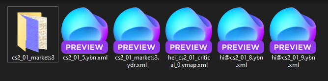
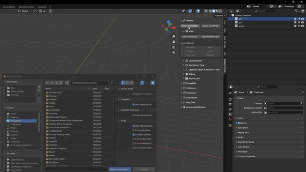
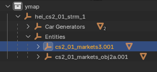
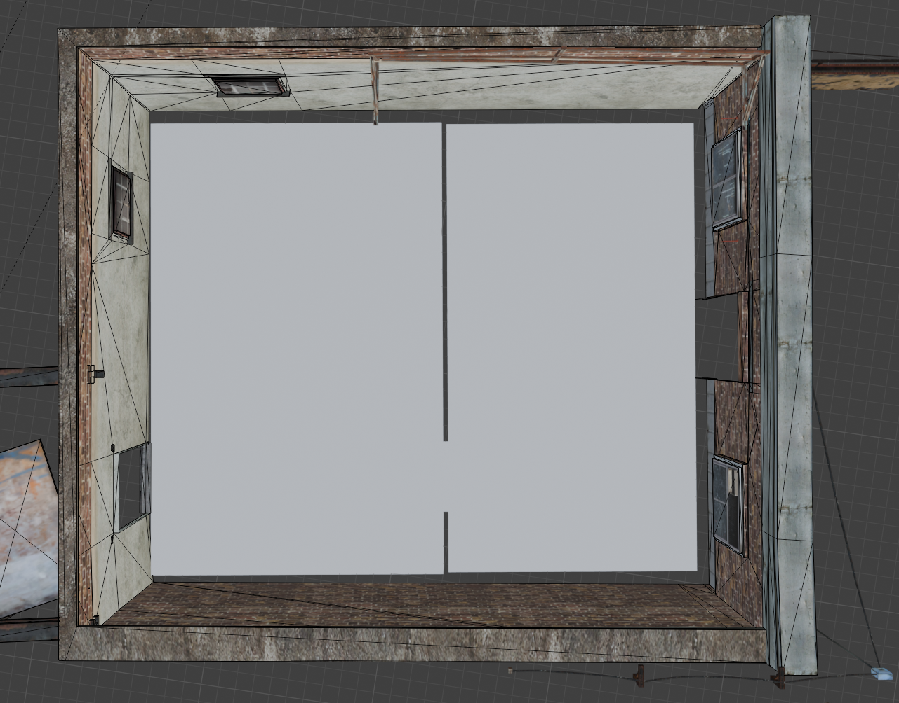
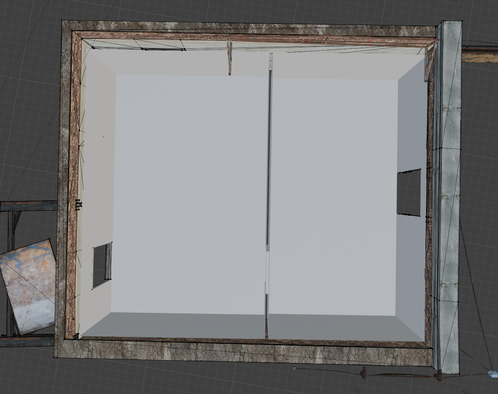
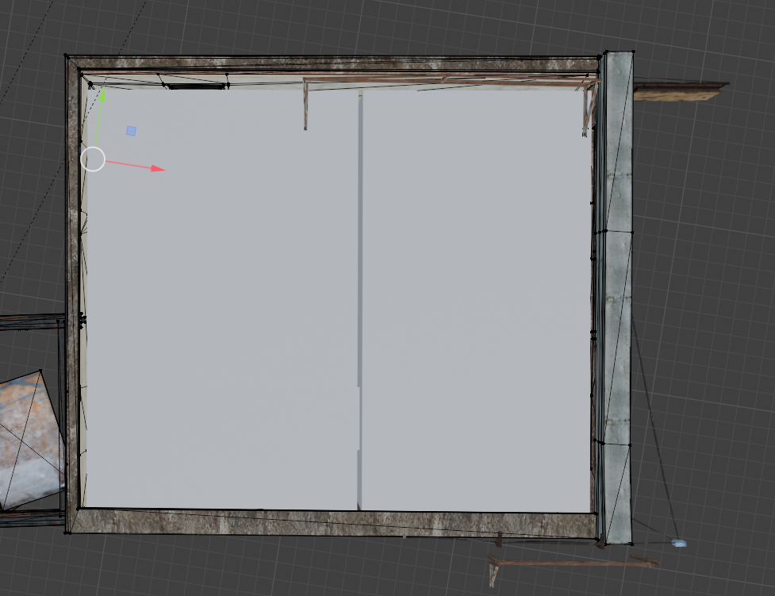
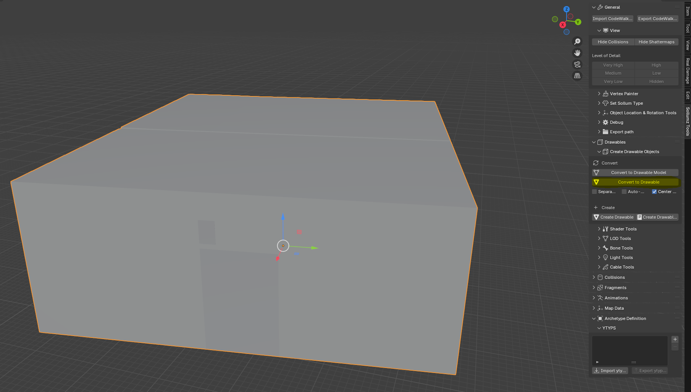

# 🏠📐 Modelling

You should now have a folder that look something like this if you only exported the building and collisions. I wil now
go ahead and export the building decals so when it is imported into Blender it will look more like the game this is
**optional** but if you will edit them you should just export it from CodeWalker now, but you can always import later so
no worries.
<figure><figcaption>

</figcaption></figure>

## Import

To start with you only import the ybn and ydr files **not** the ymap files and then the ymap file after
<figure><figcaption>

</figcaption></figure>
I have chosen to use the file hierarchy ydr ybn and ymap this is just a way to separate the files and not necessary you 
can use whatever you'd like to have you can think of it as folders 

When you have imported everything you can open the ymap file and find a copy of the building you have imported you can
go to it by pressing `NUM,` **Keybindings may vary**
<figure><figcaption>

</figcaption></figure>

## Align mesh to building

This is to make it much easier to model. We can make it so that our mesh have the orientation of the building we are
trying to make an interior inside of.

To do this we select an area that is the closest to the orientation in this tutorial the roof was the closest, so you
selected the roof and pressed `shift + NUM7` and to get the 3D cursor over you first go out of edit mode and then
presses
`shift + mouse2 (Right mouse button)` you then go up and adds a plane from mesh and in the menu down to the left press
Align -> 3D cursor, and now you have the mesh to build the floor and walls of, and it is in the right orientation and
now to get back to the normal view press `NUM5`. **Once again keybindings may vary**
<figure><figcaption>

</figcaption></figure>

## Modelling the drawable

Now it is time to actually model your interior the plane we made before is the starting point and build out from that so
you ensure that the orientation will follow for this tutorial I will just make a very simple 2 room interior

Now I have made the floor of the 2 room and removed the doors
<figure><figcaption>

</figcaption></figure>

Now add some walls
<figure><figcaption>

</figcaption></figure>

And add the roof
<figure><figcaption>

</figcaption></figure>

This part is the most time-consuming this step can be merged a bit together with the texturing but for this tutorial we
will have it operated for better overview. This is also where you edit the decals and other thing you want to edit.

## Convert to a drawable

When you have your model you need to convert it to a drawable. To convert your object(s) to a
Drawable. Select all the objects and click `Convert to Drawable` in
`Sollumz Tools > Drawable > Create Drawable Objects`.
<figure><figcaption>

</figcaption></figure>

If you navigate to `Mesh Properties > Sollumz LODs` you'll also notice that the active mesh is automatically assigned to
the "High" LOD level. This panel is where you can assign other meshes as LODs. More info on
that [here](../documentation/drawables.ydr/level-of-detail-lods-editing.md). For the
sake of this tutorial, we will only be setting the High LOD level.

NOTE:

1649.42 m

4861.21 m

41.0006 m

0.061349d

0.040145d

8.64204d
