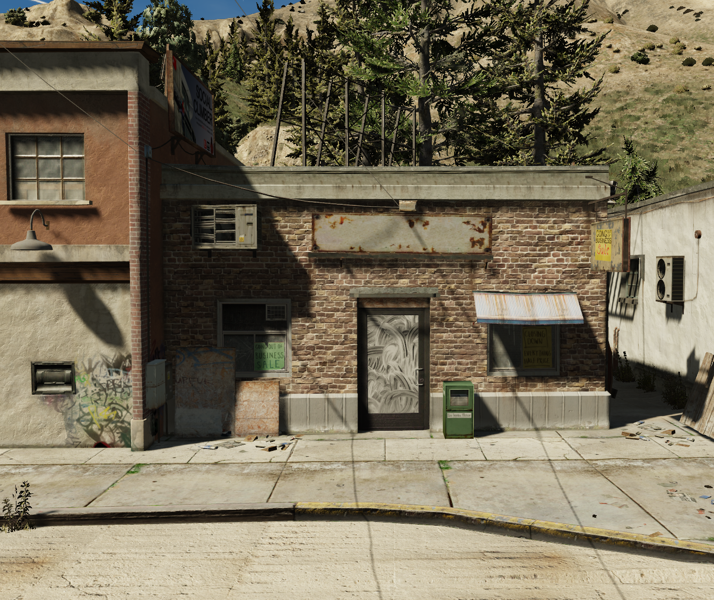

# 🏠 Picking a building

When picking a building it is a good idea to have some thoughts for what you want to make. When it's your first time make an interior it is a good idea to make a single or double roomed interior.

Start by opening CodeWalker and find the building you want to make an interior inside.

For this tutorial I have chosen this building from grapeseed.

<figure><figcaption></figcaption></figure>
