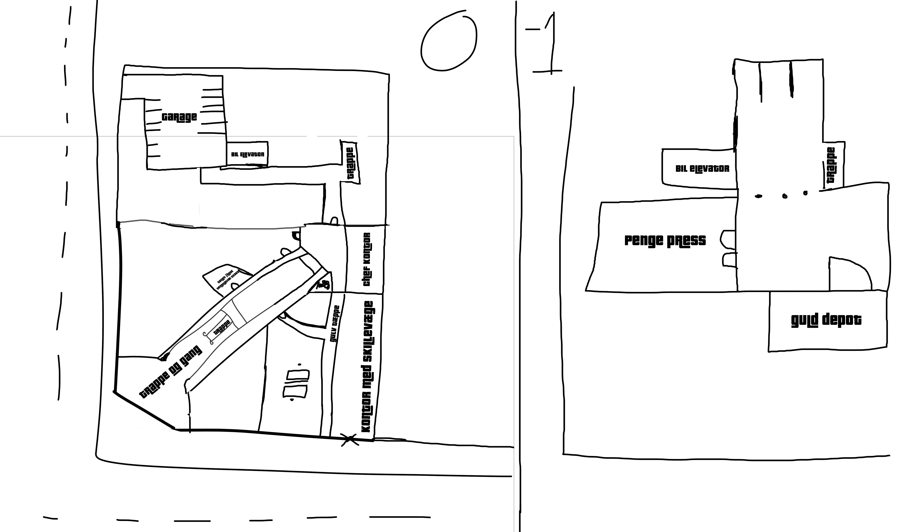
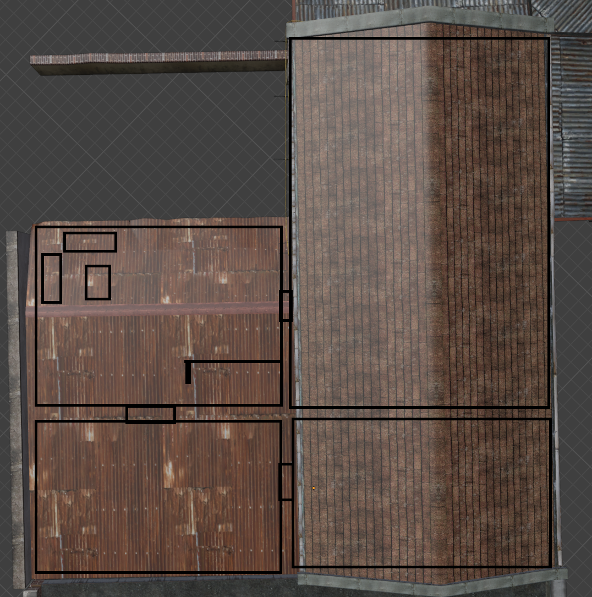

# Planning

This part is optional but a good idea for bigger interiors

When planning you can do a lot you can use Photoshop, Paint, or anything to draw what you want this do not have to be to scale. This is also a good time to make mood boards find out what you want the building be like and the art style modern, old, western, etc.

This is some floor plans I have made for interiors they are not beautiful, but they are a way to stay on target.

<figure><figcaption></figcaption></figure>

<figure><figcaption></figcaption></figure>
