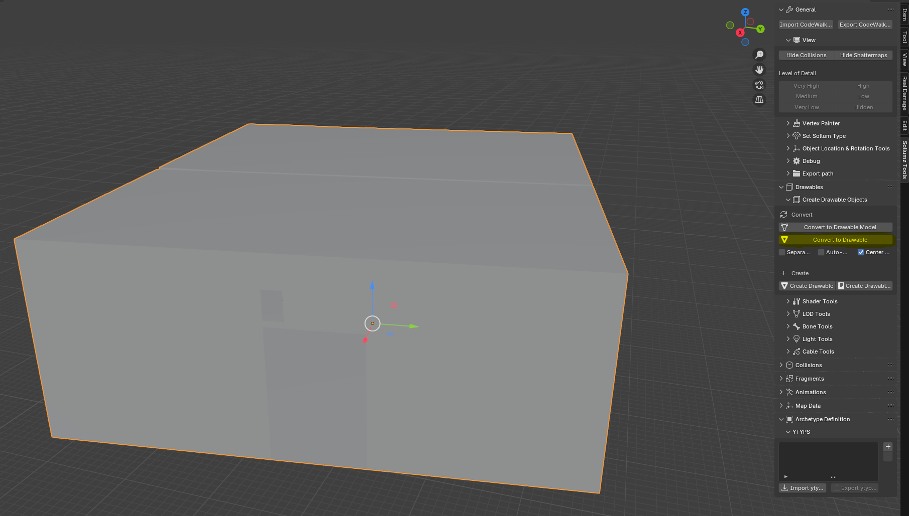

# Texturing

Next, we need to add materials to the Drawable Models. With one of the Drawable Models selected, open the `Sollumz 
Tools > Drawable > Shader Tools` panel. For this tutorial, I will use the "NORMAL" shader which allows us to specify
a base color and a normal map. Search for the "NORMAL" shader and click `Create Shader Material`.
<figure><figcaption>

</figcaption></figure>

To add a texture open shader tool and find the normal one select your drawable and then pres Create Shader Material, and
it should appear in the Material menu in this tutorial I make 1 set of textures for each room so each room have a roof,
wall, and floor. In this sample I use the normal, but you can play around with the others they have some different
attributes that can be useful
<figure><figcaption>

</figcaption></figure>

With the newly added material selected, head to the material section then open `Sollumz > Texture Parameters` then press 
the folder icon and select the texture you want.


When selecting textures you'll need to make sure their resolution is power of 2 E.g. `16x16` `32x16` `512x512` `512x16`.

It also needs to be .dds and not jpg, png, or any other file format.


<figure><figcaption>

</figcaption></figure>

When you have set a texture open the UV Editing tab where you can edit the placement of the texture if the textures is
placed wild you have to select the textures right click and press the Unwrap button
<figure><figcaption>

</figcaption></figure>

## Embedding Textures

There are 2 way to store the textures in a ytd (texture dictionary) or embedded in the model. There are reasons to use
either, but I won't come into when to use what for this tutorial i wil just use the embedded way. Chose each texture
from the menu and press the `Set all Textures Embedded` button
<figure><figcaption>

</figcaption></figure>

## Vertex coloring

To set the vertex paint open `Data > Color Attributes` and add a new color attribute called `Color 1` and it need to be 
set to Face Corner and Byte Color for this tutorial I will just use green at .2 and everything else at 0 the vertex 
coloring is something you can play around with.

Red control ambient occlusion of the model during night, most (except for night lights) will have it topped to 255 so it gets very dark at night

Green artificial light, topping this to 255 will give a self emissive power to the object. Used for objects near to 
lampposts or light sources to simulate ambient lightning

Blue moonlight illumination, how much the object reflects of the moonlight. Rockstar uses this at very frequent situations
to avoid a fully dark atmosphere

<figure><figcaption>

</figcaption></figure>
