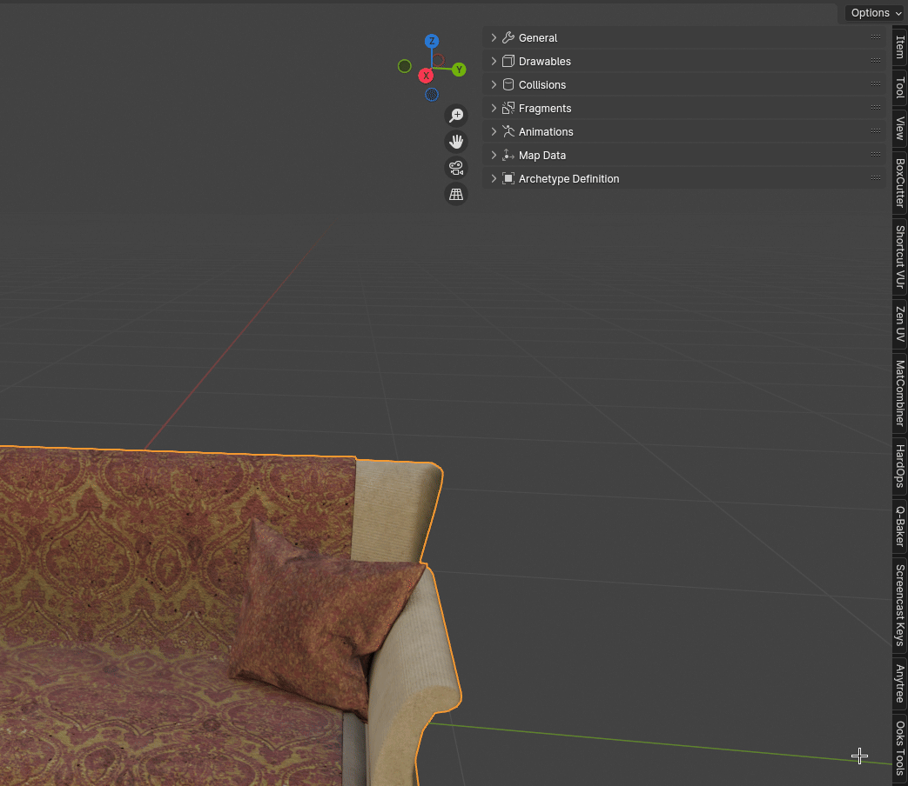

# 🌐 Converting To Drawable

Game meshes are stored in the [Drawable (.ydr)](https://github.com/Sollumz/wiki/blob/main/documentation/drawables.ydr) file format. Creating Drawables in Sollumz is very simple. This tutorial will walk you through step-by-step.

### Converting to a Drawable

The first thing to do is convert your object(s) to a Drawable. Select all the objects and click `Convert to Drawable` in `Sollumz Tools > Drawables > Create Drawable Objects`.

<figure><figcaption></figcaption></figure>

You will notice in your Scene Collection top right, that your object has changed a little. It is now in the correct hierarchy / format for GTA V.

<figure><figcaption>
Drawable Hierarchy
</figcaption></figure>

If you navigate to `Mesh Properties > Sollumz LODs` with the drawable model selected, you'll also notice that the active mesh is automatically assigned to the "High" LOD level. This panel is where you can assign other meshes as LODs. More info on that [here](../../documentation/drawables.ydr/level-of-detail-lods-editing.md). For the sake of this tutorial, we will only be setting the High LOD level.

<figure><figcaption>
Mesh Properties > Sollumz LODs
</figcaption></figure>

