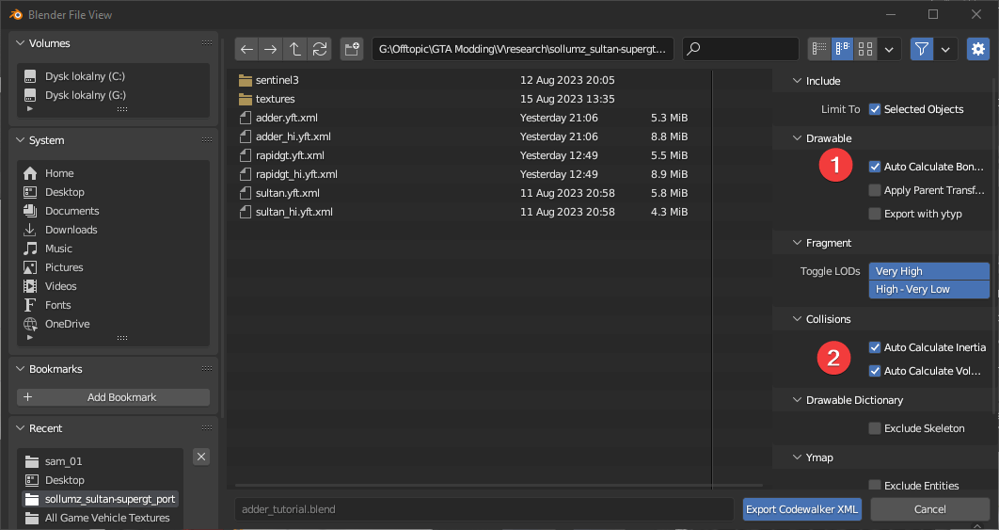

# 📤 Exporting

In the `Export Codewalker XML > Fragment` panel, you will find the two options, depending of your edits done prior in Blender.

<figure><figcaption>
Export settings with two options marked
</figcaption></figure>

First option - `Auto Calculate Bonetags` in Drawable is doing a bone number calculations. This option is needed to use when you have added a fresh new bone (i.e. a rear doors). The hardcoded bone tag value tells the game that specific bone has to be treated as rear doors. If you have not added any bones, do not select this.

Second option - `Auto Calculate Inertia` and `Auto Calculate Volume` has to be ticked if you have changed the shape of any collision mesh. Using this option provides a correct calculation for a physics engine. If you have not changed any collision shapes, do not select this.
