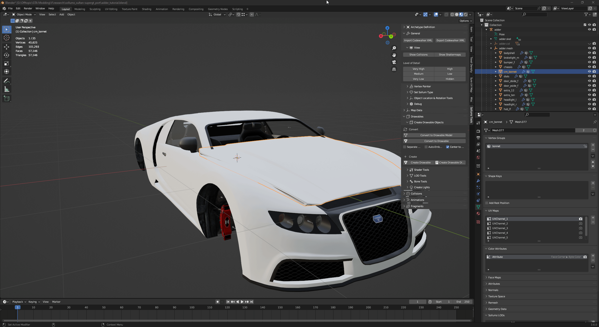

# 🍢 LOD Assignment

All models rely on LOD meshes, which greatly reduces graphics demand of detailed models and improves overall performance.


if you have any other LOD meshes ready to be set up, copy their names to the proper LOD levels.


In order to render your mesh at any distance:

1. Go to **Data** tab.
2. Scroll to **Sollumz LOD.**
3. Copy the name from High LOD to Very High, Medium and Low.

<figure><figcaption>
LOD assignment for all levels
</figcaption></figure>
